# Claude Gateway

**An orchestrator, voice, and multi-channel platform for Claude Code.**

Claude Gateway keeps conversations responsive while Claude Code workers execute tasks. Talk or type through your connected channels, follow progress, and carry your agents' memory and skills across sessions.

<p align="center">
  
</p>

[Documentation](https://0xmaxma.github.io/claude-gateway/) · [Quickstart](https://0xmaxma.github.io/claude-gateway/guide/quickstart.html) · [API reference](https://0xmaxma.github.io/claude-gateway/api/)

## What it does

- **Orchestration:** contextual acknowledgements, reusable workers, durable tasks, progress, follow-ups, and cancellation.
- **Voice:** speech recognition and spoken replies with per-agent models and voices, direct or upstream providers, and audio replay.
- **Multi-channel:** Telegram, Discord, LINE, Slack, WhatsApp, WeChat, and HTTP/SSE clients.
- **Persistent agents:** workspace identity, memory, searchable knowledge, skills, and scheduled consolidation.
- **Self-hosted operations:** authenticated APIs, CLI controls, recurring jobs, Docker apps, and monitoring.

## Get started

Install Node.js 22+, Bun, and an authenticated Claude Code CLI with channels support. Orchestration requires Linux. Docker/Compose is needed for apps; some voice formats require `ffmpeg`.

```bash
npm install -g @0xmaxma/claude-gateway
claude-gateway gateway start
```

In another terminal:

```bash
claude-gateway agents create
```

Follow the [quickstart](https://0xmaxma.github.io/claude-gateway/guide/quickstart.html), then [enable orchestration](https://0xmaxma.github.io/claude-gateway/guide/orchestration.html), [connect a channel](https://0xmaxma.github.io/claude-gateway/guide/channels.html), and optionally [configure voice](https://0xmaxma.github.io/claude-gateway/guide/voice.html).

## Learn more

| Topic | Documentation |
| --- | --- |
| Configuration and credentials | [Configuration](https://0xmaxma.github.io/claude-gateway/reference/configuration.html) |
| Agents, workers, and task controls | [Orchestration](https://0xmaxma.github.io/claude-gateway/guide/orchestration.html) |
| Platform tokens and channel setup | [Channels](https://0xmaxma.github.io/claude-gateway/guide/channels.html) |
| STT, TTS, providers, and replay | [Voice](https://0xmaxma.github.io/claude-gateway/guide/voice.html) |
| Requests, responses, streams, and permissions | [API reference](https://0xmaxma.github.io/claude-gateway/api/) |
| Running, upgrading, and troubleshooting | [Operations](https://0xmaxma.github.io/claude-gateway/guide/operations.html) |
| Source builds and contributions | [Development](https://0xmaxma.github.io/claude-gateway/reference/development.html) |

API documentation lives on the documentation website. [CLI command reference](https://0xmaxma.github.io/claude-gateway/reference/cli.html) is the generated command reference. To edit or preview this site, see [website development](website/README.md).
