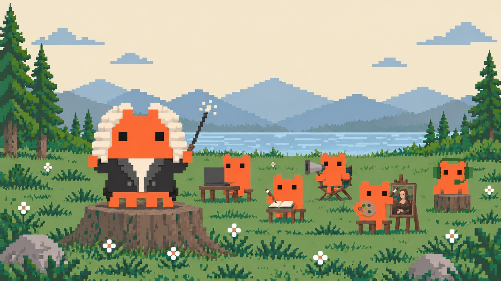

# Claude Gateway

**An orchestrator, voice, and multi-channel platform for Claude Code.**

Claude Gateway keeps conversations responsive while Claude Code workers execute tasks. Talk or type through your connected channels, follow progress, and carry your agents' memory and skills across sessions.

<p align="center">
  
</p>

[Documentation](https://0xmaxma.github.io/claude-gateway/) · [Quickstart](https://0xmaxma.github.io/claude-gateway/guide/quickstart.html) · [API reference](https://0xmaxma.github.io/claude-gateway/api/)

## Features

- 🪄 **Agent Orchestration Engine** — responsive conversations while workers execute durable tasks. The dashboard separates Agent/worker token usage and offers per-session reports with cache and tool details. Existing configurations without the switch are upgraded automatically; explicit `false` remains an opt-out. See [orchestration settings](https://0xmaxma.github.io/claude-gateway/reference/orchestration-settings.html).

- 🔥 **Agent orchestration** — keep conversations responsive while reusable workers execute durable tasks, report progress, accept follow-up instructions, and support cancellation. See [orchestration and tasks](https://0xmaxma.github.io/claude-gateway/guide/orchestration.html).
- ⚙️ **Worker harnesses** — optionally run GPT workers through native Codex on the host or inside app containers while conversational agents remain on Claude Code. See [worker harnesses](https://0xmaxma.github.io/claude-gateway/guide/worker-harnesses.html).
- 🎙️ **Voice conversations** — speech recognition and spoken replies with per-agent models and voices, direct or upstream providers, live or recorded speech input, and audio replay. See [voice setup](https://0xmaxma.github.io/claude-gateway/guide/voice.html).
- 🧠 **Skill self-improvement** — agents learn reusable skills from their own work: after a substantive turn a background reviewer creates or updates a skill, hot-reloaded for the next turn. Provenance-guarded (never overwrites human-written skills), capped per day, and audited to `SKILLS_LEARNED.md`. See [`gateway.skillLearning`](https://0xmaxma.github.io/claude-gateway/reference/memory-settings.html#gateway-skilllearning)
- 📚 **Knowledge base (two-lane memory)** — per-agent SQLite/FTS5 searchable archive exposed through `memory_search` / `memory_get` MCP tools, so agents recall notes that don't fit the always-injected core; chunks carry fail-closed provenance and the index is refreshed off the gateway event loop. See [`gateway.knowledge`](https://0xmaxma.github.io/claude-gateway/reference/memory-settings.html#gateway-knowledge)
- 🌙 **Nightly dreaming** — background consolidation of long-term memory: a print-only reviewer proposes ops that a safe applier writes to `MEMORY.md` / `USER.md` (backup, bounded-loss, net-negative when over budget). Deterministic compaction, budget-scaled pruning, and staleness GC keep memory near budget without forgetting — archived entries stay searchable. See [`gateway.dreaming`](https://0xmaxma.github.io/claude-gateway/reference/memory-settings.html#gateway-dreaming)
- 🤖 **Multi-agent** — run multiple bots from a single gateway, each with isolated sessions
- 🔌 **Multi-channel MCP** — modular tool system per channel (Telegram, Discord, LINE, Slack, WhatsApp, Cron, Skills, extensible to more)
- 📥 **Channel ingress recovery** — unavailable attachments preserve the message and readable files; Telegram/Discord receiver retries isolate conversations and archive stale startup queues without executing old requests. See [ingress recovery](https://0xmaxma.github.io/claude-gateway/api/orchestration.html#channel-ingress-recovery).
- 🧩 **Agent skills** — extensible skill system via SKILL.md files; agents can create, delete, and install skills from URLs at runtime with hot-reload
- 🎭 **Agent identity** — define personality, tone, and rules via workspace markdown files
- 📡 **Live status messages** — real-time status updates showing tool usage, thinking, and progress
- ⌨️ **Typing indicators** — continuous typing animation while the agent is working (Telegram and Discord)
- 🌊 **Streaming API** — SSE (Server-Sent Events) endpoint for real-time response streaming
- ↪️ **Auto-forward** — agent text output automatically forwarded to Telegram even without explicit reply tool calls
- ⏰ **Heartbeat / scheduled tasks** — cron-based proactive messages and recurring tasks via HEARTBEAT.md + REST API; agent jobs deliver output to Telegram, Discord, or both
- 💬 **Persistent chat history** — two-layer storage: session context (`.jsonl`) + permanent SQLite DB with FTS5 full-text search; survives `/compact` and session eviction
- 🧹 **Auto-cleanup** — configurable retention policy prunes messages and media files older than N days on a daily schedule
- 🗄️ **Long-term memory** — persistent memory system across sessions
- 🔄 **Config auto-migration** — automatic schema migration when config format changes
- 🔐 **Access control** — allowlist, open, or pairing-based Telegram access policies
- 🌐 **HTTP API** — REST API with key-based auth for external integrations
- 🛍️ **App Store** — install, update, and host Docker-compose apps on the gateway; apps get a reverse proxy at `/app/:name/:portName/*`, optional Unix socket bridge for host scripts, and optional AI agent injection
- ⬆️ **Self-update** — check for newer versions of `claude-gateway` and `claude-code` and trigger an update via a single API call (no SSH or shell access needed), or from the terminal with `claude-gateway update` / `claude-gateway claude update`
- 💾 **Session persistence** — conversation history saved and restored across restarts
- 🖥️ **PTY shell (wrap-shell mode)** — optional interactive pseudo-terminal backend (`gateway.headless: false`) for tools that require a real TTY; includes a live browser viewer (xterm.js) and a `/api/v1/sessions/:sessionId/screen` endpoint that returns the visible screen as plain text — agents can poll it to detect hang states, menus, or unexpected output without parsing ANSI escape codes; a `/cli` chat command (Telegram/Discord/LINE) opens the same viewer for a single agent, agent-scoped and without an admin key; app-agents and orchestration always stay headless

## Get started

Install Node.js 22+, Bun, and an authenticated Claude Code CLI with channels support. Orchestration requires Linux. Docker/Compose is needed for apps; some voice formats require `ffmpeg`.

```bash
npm install -g @0xmaxma/claude-gateway
claude-gateway gateway start
```

In another terminal:

```bash
claude-gateway agents create
```

Follow the [quickstart](https://0xmaxma.github.io/claude-gateway/guide/quickstart.html), then [enable orchestration](https://0xmaxma.github.io/claude-gateway/guide/orchestration.html), [connect a channel](https://0xmaxma.github.io/claude-gateway/guide/channels.html), and optionally [configure voice](https://0xmaxma.github.io/claude-gateway/guide/voice.html).

## Learn more

| Topic | Documentation |
| --- | --- |
| Configuration and credentials | [Configuration](https://0xmaxma.github.io/claude-gateway/reference/configuration.html) |
| Agents, workers, and task controls | [Orchestration](https://0xmaxma.github.io/claude-gateway/guide/orchestration.html) |
| Platform tokens and channel setup | [Channels](https://0xmaxma.github.io/claude-gateway/guide/channels.html) |
| STT, TTS, providers, and replay | [Voice](https://0xmaxma.github.io/claude-gateway/guide/voice.html) |
| Requests, responses, streams, and permissions | [API reference](https://0xmaxma.github.io/claude-gateway/api/) |
| Running, upgrading, and troubleshooting | [Operations](https://0xmaxma.github.io/claude-gateway/guide/operations.html) |
| Source builds and contributions | [Development](https://0xmaxma.github.io/claude-gateway/reference/development.html) |

API documentation lives on the documentation website. [CLI command reference](https://0xmaxma.github.io/claude-gateway/reference/cli.html) is the generated command reference. To edit or preview this site, see [website development](website/README.md).

### Installation health

Run `claude-gateway doctor` to check startup, voice and optional Codex dependencies, even when the
server is down. Use `claude-gateway doctor fix` for supported local repairs and
installation of missing `ffmpeg`/`ffprobe`. Repair asks for confirmation and never
starts or restarts the gateway. See [diagnosis and repair](https://0xmaxma.github.io/claude-gateway/guide/troubleshooting.html#gateway-will-not-start-doctor-and-repair).

Browser voice can resume unheard approved replies after navigation. Clients retain
per-session mode/mute intent and reconnect with playback receipts; see the
[voice resume protocol](website/api/voice.md#resume-browser-voice-after-navigation).

Browser replay is available for approved spoken replies before their original
recording completes, including interrupted playback. Explicit replay can generate
missing audio with the configured TTS provider (normal provider charges apply).
See the [replay and playback controls](website/api/voice.md#retained-speech-replay).

### Safemode investigations

Run `claude-gateway safemode --name investigation --prompt "Inspect this gateway problem"`
for a native interactive Claude Code investigation without stopping the gateway.
Use `--cli codex` to select Codex, `--model` to override the native model, and
`--resume investigation` to return to the same investigation. Safemode preserves
build/startup evidence and uses a separate source snapshot. Session IDs are the
native Claude Code/Codex IDs; `safemode rename ID NEW_NAME` changes the alias
without interrupting the conversation. Headless takeover,
request IDs and trusted operator agent controls are described in the
[safemode guide](website/guide/safemode.md).
