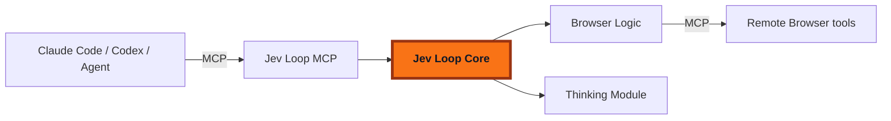

# Jev evaluations

Jev evaluates bounded state against typed questions. Use it to choose among observed options, score a rubric, or estimate the probability of a yes/no answer. It does not generate a conversational reply, grant permissions, or prove that an action succeeded.

The optional gateway service provides a single client for authorized agents, workers, API adapters and in-process features. Configure a direct TypeSafe connection or a compatible upstream. The gateway does not host the model or require any particular hosted platform.

## Configure a direct connection

Merge this fragment into your configuration:

```json
{
  "gateway": {
    "jev": {
      "enabled": true,
      "provider": "typesafe",
      "model": "jev-1.13.0",
      "apiKeyFile": "/path/to/private/jev.key",
      "allowedAgentIds": ["assistant"]
    }
  }
}
```

Store only the key in that file and restrict its filesystem permissions. Alternatively, set `apiKeyEnv` to the name of an environment variable available to the gateway process. Do not configure both references. Without either reference, direct mode reads `TYPESAFE_API_KEY` from the gateway environment.

Use a dedicated credential environment name such as `PRIVATE_JEV_TOKEN` or `GATEWAY_JEV_API_KEY`. Native CLI authentication/control names such as `ANTHROPIC_API_KEY`, `OPENAI_API_KEY`, `CODEX_HOME`, `HOME`, and `PATH` are rejected as `apiKeyEnv`. To reuse a native upstream identity, use the upstream resolver below instead of repurposing its environment variable.

The gateway removes `TYPESAFE_API_KEY`, `JEV_API_KEY` and configured Jev credential variables from child-process environments after applying overlays. It also excludes them from generated MCP/Codex shell environment overrides and masks them when launching container processes. Previously configured variable names remain private during the current gateway process after a hot reload. Gateway-created capability/skill probes, native MCP adapters and managed safemode requests use the same filtering. Managed safemode CLI descendants inherit a names-only exclusion policy so gateway dotenv loading cannot restore filtered credentials. Native CLI authentication variables and independently launched terminal CLIs keep their existing behavior. Remove retired secrets from service environments before restarting; use a key file if you want to avoid inherited environment credentials entirely. This prevents automatic forwarding, not arbitrary filesystem access by a separately privileged host tool.

Direct requests use `https://api.typesafe.ai/v1/systemone` by default. Model versions and aliases come from the [TypeSafe model catalog](https://docs.typesafe.ai/models); choose a supported version deliberately. The result records the actual version reported by the provider.

## Configure a compatible upstream

An upstream owns its catalog, account routing, credential storage and billing. Model IDs are opaque: the gateway forwards prefixes and slashes unchanged and does not interpret them as a billing source.

To reuse the gateway's existing upstream identity:

```json
{
  "gateway": {
    "jev": {
      "enabled": true,
      "provider": "upstream",
      "model": "catalog-prefix/jev-version",
      "allowedAgentIds": ["assistant"]
    }
  }
}
```

The resolver selects an endpoint and credential **as one group**. If Claude settings contain any of `ANTHROPIC_BASE_URL`, `ANTHROPIC_AUTH_TOKEN`, `ANTHROPIC_API_KEY`, or `CLAUDE_CODE_OAUTH_TOKEN`, that settings group must contain both a URL and a usable credential. Otherwise, the same group is read from the gateway's inherited environment. An incomplete settings group is an error; it is never combined with another identity's environment values. This does not modify native CLI authentication.

For an independent compatible provider, configure both the endpoint and a credential reference:

```json
{
  "gateway": {
    "jev": {
      "enabled": true,
      "provider": "upstream",
      "baseUrl": "https://inference.example.com",
      "apiKeyEnv": "JEV_UPSTREAM_KEY",
      "model": "catalog-prefix/jev-version"
    }
  }
}
```

An explicit upstream `baseUrl` requires an explicit credential reference, and vice versa. URLs require HTTPS, except HTTP on `localhost`, `127.0.0.1`, or `[::1]` for local development. URL credentials, query strings, fragments and redirects are rejected. Tool callers cannot supply a URL or key.

The default compatible path is `/v1/jev/evaluate`. A base ending in `/v1` or the full evaluation path is also supported. A leading deployment path is retained. This is the gateway's compatibility contract, not a claim that every inference provider already implements it.

## Access, limits and reload

| Setting | Default | Meaning |
| --- | --- | --- |
| `enabled` | Off | Explicit opt-in |
| `allowedAgentIds` | All agents when omitted | Restrict access; an empty array allows none |
| `timeoutMs` | `5000` | Entire evaluation, including queue wait and credential resolution |
| `maxConcurrentRequests` | `4` | Shared active evaluation limit |
| `maxQueueSize` | `16` | Bounded number waiting for a slot |
| `maxInputBytes` | `131072` | UTF-8 JSON request size; excess input is rejected |
| `maxQuestions` | `64` | Maximum question count; no silent truncation |

Each agent can set `jev.enabled: false` to narrow global permission. An agent cannot expand the global allowlist. Existing task/ticket/agent access checks still apply. An evaluation grants no additional access to another agent's tasks, memory or browser sessions.

`gateway.jev` and agent Jev access settings reload live. Each new request captures its configuration; an in-flight request retains that model/connection generation. Access and global enablement are checked again before dispatch and before returning an answer. Revocation discards the decision, although a request already sent may still incur provider usage. Key files are read for each request, allowing rotation without restart. Changing a parent shell variable does not update the environment of an already running gateway.

There are no automatic retries or automatic switches to another billing source. A timeout or cancelled request does not establish that the provider did no work or charged nothing.

The `features` block reserves `browserTasks`, `skillRouting`, `progressFiltering`, and `conversationIntake` enable flags. These do not automatically install a browser adapter or activate future classification features. See the implementation boundary below.

## Typed questions and answers

State and instructions accept text, a JSON object, or a JSON array. The service validates the full response against every question, including allowed options, probability ranges/distributions, score levels and nonnegative integer usage. Unexpected answer keys or missing answers fail the request.

```json
{
  "state": "The user wants to compare two options before deciding.",
  "questions": {
    "needs_decision": {
      "type": "noul",
      "instructions": "Does the user still need to make a decision?"
    },
    "next_step": {
      "type": "choice",
      "instructions": "What is the appropriate next step?",
      "criteria": {
        "explain": "Compare the options for the user.",
        "execute": "Execute a clearly authorized choice."
      }
    },
    "clarity": {
      "type": "score",
      "instructions": "How clear is the requested action?",
      "criteria": ["Unspecified", "Partially specified", "Fully specified"]
    }
  }
}
```

- **Noul:** `{ "type": "noul", "noul": 0.8 }`. The number is a yes probability, not a fabricated confidence field.
- **Choice:** chosen option, a probability for every option, and confidence. Supports 1–255 options.
- **Score:** probability-weighted score, indexed level probabilities, a legend, and confidence. Supports 2–10 levels.

Consumer policy belongs outside the client. Browser operation confidence, target confidence, skill relevance and progress filtering need different decisions and thresholds. A high probability is never authorization.

## MCP and worker access

Authorized orchestrators and workers can use `mcp__gateway__jev_evaluate` with `state` and `questions`. The gateway derives agent/session/task identity from authenticated runtime context; these fields, provider URLs, model overrides and keys are not tool arguments.

The same service is used for Claude Code and Codex workers, including app-container bridges. Vendor keys remain outside the container. Capability discovery and tool availability still depend on the current agent's permissions and process inventory; merely enabling Jev does not bypass those checks.

An external MCP server does not automatically gain access to another server's tools. Use the authenticated HTTP API with an agent-scoped write key, or inject an in-process evaluation callback into an adapter. Do not delegate an admin key.

## HTTP evaluation and usage

`POST /api/v1/jev/evaluate` requires an API key with write access to the specified agent, plus enabled Jev access for that agent. Evaluation is treated as a paid action. A read-only key cannot initiate it.

```bash
curl --fail-with-body http://127.0.0.1:10850/api/v1/jev/evaluate \
  -H "Authorization: Bearer $CLAUDE_GATEWAY_API_KEY" \
  -H 'Content-Type: application/json' \
  --data '{"agentId":"assistant","state":"Hello","questions":{"greeting":{"type":"noul","instructions":"Is this a greeting?"}}}'
```

Successful gateway response:

```json
{
  "requestId": "opaque-request-id",
  "requestedModel": "catalog-prefix/jev-version",
  "model": "jev-1.13.0",
  "answers": { "greeting": { "type": "noul", "noul": 0.99 } },
  "usage": { "input_tokens": 120, "output_tokens": 8 }
}
```

Optional `billing` contains `charged_credits` and an optional `rate_version`, as reported by the compatible upstream. These are not inferred from token counts or multiplied again by the gateway.

`requestId` is optional on requests. Reusing an ID within the same caller scope is rejected rather than silently repeating a paid request. The local ledger is bounded and retained for five minutes; it is not durable across gateway restarts. Upstream IDs are hashed and caller-scoped. Durable deduplication and billing reconciliation belong to the upstream; a conflict response is not a cached answer.

Read usage with `GET /api/v1/jev/usage?agentId=assistant&limit=50&offset=0`. The API returns `{ "records": [], "total": 0 }` when no measurements exist. Read access to that agent is required. `limit` is 1–100 and `offset` is nonnegative. Usage records contain metadata, latency, outcome, model, reported usage and optional billing, never raw state, questions, DOM or credentials. The local store retains at most 10,000 records. Jev requests are separate from conversational context-window tokens.

Errors expose a typed `JEV_...` code where the evaluation service handles the failure: invalid request/configuration, access denial, missing credentials, unsupported model, quota, rate limit, timeout, cancellation, provider failure, malformed response or request conflict. Safe retry/reset headers are retained when supplied; raw provider error bodies are not exposed because they can contain submitted state or credentials.

## Compatible upstream wire contract

The gateway sends this provider request, authenticated with the selected upstream credential:

```json
{
  "request_id": "caller-scoped-request-id",
  "model": "catalog-prefix/jev-version",
  "state": "Hello",
  "questions": { "greeting": { "type": "noul", "instructions": "Is this a greeting?" } }
}
```

The compatible upstream returns native `model`, `answers`, and `usage` in the TypeSafe shape, plus `request_id` and `requested_model` to identify the submitted request. Optional billing uses the shape above. Extra provider-specific routing metadata is not exposed as authorization. Direct TypeSafe requests contain only `model`, `state`, and `questions`.

The gateway distinguishes native version from requested catalog ID. A prefixed catalog identifier must never be replaced with an unprefixed native model before upstream routing.

## Browser tasks with an installed adapter

Gateway owns authorization, task scheduling, cancellation, durable receipts and Jev evaluation. Browser Logic is included in `@0xmaxma/jev-loop/browser`; it owns observation interpretation, decisions, lease handling, stale recovery and action selection. Remote Browser provides the MCP tools. No separately installed adapter or module path is configured.

Merge the following into an enabled Jev configuration:

```json
{
  "gateway": {
    "jev": {
      "enabled": true,
      "provider": "typesafe",
      "model": "jev-1.13.0",
      "apiKeyEnv": "PRIVATE_JEV_TOKEN",
      "features": { "browserTasks": { "enabled": true } },
      "browser": {
        "bindings": [{
          "id": "approved-browser",
          "name": "Approved browser tab",
          "agentId": "assistant",
          "principalId": "authenticated-principal",
          "conversationId": "orchestration-conversation-id",
          "endpoint": "https://browser.example/mcp",
          "apiKeyFile": "/path/to/private/browser-controller.key",
          "scope": { "device_id": "device", "grant_id": "approved-grant", "tab_id": "tab" },
          "fields": [{ "label": "Name", "text": "Explicit user-supplied value" }],
          "budget": { "maxSteps": 20, "maxEvaluations": 30, "timeoutMs": 120000 }
        }]
      }
    }
  }
}
```

The built-in Logic receives goal, exact scope, explicit fields and budgets. Gateway injects MCP calls, Jev evaluation, Thinking and progress. Without independent verification, completion remains a candidate for parent verification; missing field values are handed back to the parent. Provider credentials remain host-owned.

Each binding belongs to one agent, principal **and orchestration conversation**. A conversation ID is not the native CLI/session ID; obtain it from the authenticated orchestration task/conversation data. Browser device/grant/tab values must come from an already approved browser session. Setting a binding does not grant consent. Manual bindings and task receipts remain private to their configured principal/conversation. Automatic discovery follows the existing connector-sharing policy: every user of an enabled shared agent/connector can discover its relay-approved tabs and receives a separate binding. These bindings do not make the underlying shared browser private; use separately scoped connectors or manual bindings for isolation. The gateway checks exact binding ownership before dispatch and callbacks; the extension/relay must independently enforce actual-tab ownership, grant, lease and observation freshness at execution.

The connector uses authenticated Streamable HTTP MCP, accepts HTTPS or loopback HTTP only, refuses redirects and does not expose credentials to agents or app containers. Choose one `apiKeyFile` or dedicated `apiKeyEnv`; browser credential environment variables are stripped from managed children just like Jev credentials. Removing/changing a binding or disabling permissions fences active work; a bounded best-effort lease release may still occur. Credential changes take effect on the next connection. Runtime code/module updates require restart.

Agents discover their targets with `capabilities_list(scope="browser")` and submit through `task_spawn(target_profile="gateway-managed", gateway_target={adapter:"browser",session_id:"approved-browser"})`. This uses the same task tracking and completion delivery as other managed work. App agents receive scoped task tools through their bridge, not the MCP controller key, a host shell or safemode permissions. Newly enabled capabilities may require a fresh CLI process inventory.

### Results, recovery and reporting

- `succeeded / VERIFIED` becomes completed only when the adapter's trusted independent verifier passed and permission remains valid.
- `blocked / FIELD_TEXT_REQUIRED` uses the existing task question flow. The parent receives the missing field label when available. Answering is a new authorized bounded attempt; old element refs are not replayed. For an unambiguous missing field, the gateway binds the authenticated task answer to that field label and supplies its exact text to the fresh run. Previously answered fields remain available. Ambiguous labels require parent inspection; no stale element reference is reused. Answers longer than 2,000 characters are rejected before browser dispatch.
- `needs_verification` and other bounded handoffs require parent reconciliation. Keep the exact reason rather than pretending that DONE proved completion.
- Any unknown mutation outcome takes precedence, including after cancellation. Preserve operation IDs; do not replay automatically.
- Confirmed cancellation stops the request. A adapter ignoring cancellation is bounded by a watchdog and remains uncertain, not confirmed stopped.

A durable running receipt is written **before** dispatch. A running receipt found after restart becomes `BROWSER_EXECUTION_INTERRUPTED`; no second action is sent. Each private receipt retains the bounded observation and full result for authorized local investigation. Raw page observations are not copied to default logs or conversational token usage. Task status, dashboard detail and channel task detail expose outcome/reason, action/evaluation counts and safe correlation metadata. Jev records link evaluations to agent, session and task independently of conversational model usage.

### Integration validation

`scripts/jev-browser-smoke.cjs` exports `runGatewayBrowserFixture(options)` for a browser project's isolated fixture. It executes the **actual gateway task controller, durable adapter, built-in Browser Logic and authenticated MCP connector**. The caller supplies an installed public entrypoint, approved fixture scope, controller credential file, goal/fields and evaluator callback. Use real relay/extension/browser fixtures; fake MCP tests alone do not prove end-to-end integration. No paid inference is performed without an explicitly injected live evaluator.

Test verified effects, missing field input, absent/false verification, stale rejection, uncertain mutations, cancellation/revocation/disconnection, gateway restart, cross-agent/principal/conversation denial and app-agent isolation. Test direct/upstream managed/BYOK accounting separately with live credentials. Do not claim comparative token savings or production browser reliability from a small synthetic sample.

## Optional skill recommendations

`src/jev/skill-routing.ts` exports `recommendJevSkills()` for integrations that already know the **effective authorized skill catalog** for the current principal, worker harness, and host or container. This is an opt-in metadata helper, not an installed Claude Code/Codex hook. Setting a feature flag alone does not automatically discover skills or change native worker routing.

The caller supplies stable local IDs, names, descriptions, and applicability flags. Only task context and names/descriptions go to the evaluator; the helper does not read or transmit skill files, local paths, plugin configuration, or full bodies. Supply a short current-task description with enough context for follow-ups, rather than the whole conversation. Do not put secrets or filesystem paths inside the names/descriptions themselves.

```ts
const routing = await recommendJevSkills({
  enabled: config.features?.skillRouting?.enabled === true,
  nativeRoutingActive: nativeSkillPluginAlreadyHandlesThisInput,
  task: currentInstruction,
  context: currentTaskSummary,
  catalog: authorizedEffectiveCatalog,
  explicitIds: explicitlyRequestedSkillIds,
  requiredIds: requiredSkillIds,
  ongoingIds: ongoingTaskSkillIds,
  catalogVersion: version,
  currentCatalogVersion: () => effectiveCatalogVersion(),
  evaluate: (request, signal) => jevService.evaluate(request, {
    principalId,
    agentId,
    consumer: 'skill-routing',
    signal,
    authorize: currentPrincipalMayUseJev,
  }),
  signal: taskSignal,
});
```

Explicitly requested, required, and ongoing skills are retained separately and are not scored. Disabled, inaccessible, and manual-only entries are excluded from **optional** recommendations. Explicit manual-only skills remain eligible to be preserved. A missing, disabled, or inaccessible required entry triggers native fallback instead of silently dropping the requirement; the native path still enforces current permissions.

Each optional skill receives an independent Noul relevance probability, so multiple skills can be recommended. The default threshold is `0.6`; it is configurable by the integration and is not proof that a skill is correct. Low probabilities produce no optional recommendation, without being treated as an API error.

All candidates must fit the configured batch, request-size, and total-time bounds. The helper validates every planned batch before the first evaluation, never silently truncates the catalog or context, and falls back to native selection on oversized input, invalid or missing answers, errors, cancellation, or catalog-version changes. A failed later batch discards earlier partial recommendations. Defaults are 32 candidates per batch, 32 batches, 64 KiB per request, and a 10-second deadline for the entire operation; configure these to fit the shared evaluation service's limits.

Use `mode === 'native'` to keep ordinary skill selection. With `mode === 'recommended'`, retain `preservedIds` and map `recommendedIds` back to the still-authorized local catalog before reading skill bodies. Recommendations grant no MCP/tool access and never prevent the worker from discovering additional skills later. Coordinate with native routing plugins: if one already owns this input, pass `nativeRoutingActive: true` so this helper does not issue duplicate requests.

No automatic native hook is installed by this helper, and no measured token saving is claimed. Selecting metadata does not unload tool schemas. Integrations must measure actual loaded context and task quality before enabling routing broadly.

## Check readiness and troubleshoot

Run `claude-gateway doctor` after editing configuration. When Jev is enabled, its local check validates the configuration and checks referenced credential-file readability/size or the direct credential environment reference. It does not prove upstream authentication or perform paid Jev inference. Use the bounded HTTP example above when you explicitly want to test the configured provider end to end.

- **Configuration rejected:** check the provider/model, numeric limits, credential reference and complete endpoint/credential group.
- **No tool:** check global enablement, `allowedAgentIds`, agent disablement and the current runtime's tool inventory.
- **Authentication failure:** verify the file/environment is readable under the gateway's service user. A key configured only in an interactive shell may not exist in the service environment.
- **Quota or rate limit:** inspect the upstream account and supplied retry/reset metadata. The gateway does not switch to a different account automatically.
- **Malformed response:** verify that the upstream implements structured evaluation rather than returning a chat completion or event stream.
- **Browser did not complete:** inspect handoff/unknown outcomes and independent evidence. Do not turn `needs_verification` into success or retry an uncertain mutation automatically.

## Bind an existing MCP connector to a conversation

Browser bindings can reference an already connected HTTP MCP connector using `connectorId`, instead of `endpoint` plus `apiKeyEnv`/`apiKeyFile`. These forms are mutually exclusive. Gateway uses its existing connector secret store and per-agent enablement; it never copies the resolved credential into the binding, task arguments or API response. The HTTP connector must use an Authorization header and a secure endpoint (HTTPS, or loopback HTTP for local fixtures). Other header-based authentication schemes are currently rejected explicitly.

An administrator configures `gateway.jev.browser` with `bindings: []`, enables `features.browserTasks.enabled`, and grants the agent Jev access. Installing code or selecting executable modules is not exposed to conversational tools or these APIs.

All routes below are under `/api/v1/agents/:agentId/sessions/:sessionId`:

| Method and suffix | Behavior |
| --- | --- |
| `GET /browser-bindings` | List bindings for the authenticated principal and existing active conversation. No credentials or page content. |
| `POST /browser-bindings` | Admin-only: create an approved tab binding from an existing enabled connector. |
| `DELETE /browser-bindings/:bindingId` | Admin-only: remove that scoped binding and fence ongoing access. |
| `GET /tasks/:taskId/browser-evidence` | Read the scoped task's retained receipt/observation; never invokes inference. |
| `GET /tasks/:taskId/browser-evidence?refresh=true` | Inspect the currently approved tab and retained operation ID without replaying an action. |

Example POST body:

```json
{
  "connectorId": "paired-browser",
  "name": "Approved research tab",
  "scope": { "device_id": "device", "grant_id": "grant", "tab_id": "tab" }
}
```

The server derives principal and conversation from the authenticated API key and session membership. It rejects caller-supplied identity, endpoint, secrets and executable configuration. A missing or ambiguous active conversation is rejected: start the conversation first. Admin authority does not bypass its session membership. The API confirms the approved scope with a bounded leased observation before persisting the binding using the shared config-write lock. This never requests new consent after Stop/revoke. The lease is released after inspection; an occupied or revoked tab fails closed. No model evaluation is made by binding or inspection.

Create bindings only after the external browser's normal user consent flow. List/select device, grant and tab through the existing connector's resource UI. The control plane owns that UI and installation/version pinning; Gateway remains independent of any browser product. Use the same stable API-key identity as the conversation. Connector removal, disabling, endpoint/header changes or credential rotation invalidate running binding identities. New attempts resolve current credentials. Removing one binding does not disconnect the underlying connector or other approved conversations.

### Parent verification and recovery

The parent agent can call `task_status` with `task_id` and `browser_evidence: "recorded"` or `"fresh"`. Evidence is explicitly requested rather than injected into every task index. It is private, bounded, untrusted page data, not instructions. Fresh inspection uses a short-lived tab lease and returns an `evidenceId`; it also reads `operation_status` only for the operation ID in the task's durable receipt. Interrupted receipts can still inspect the page, but their unknown state never becomes permission to repeat an action or confirm completion.

For a finished `COMPLETION_CANDIDATE` or `VERIFICATION_FAILED` request, the parent independently compares the fresh observation with the complete user goal. If verified, it calls `task_update` with:

- `mode: "verify_browser"`, `task_id` and the current `expected_revision`;
- `expected_request_id` and `evidence_id` from the fresh evidence response;
- `instruction`: concrete evidence establishing the goal, not merely the adapter's DONE decision.

Proof expires after five minutes and is tied to the task/request. Current permissions, decision epoch, execution authorization and revision are checked. Confirmation is idempotent and releases the task slot, records parent verification separately from the adapter verdict, and delivers normal completion. Unknown mutations, interrupted executions, unsupported goals and missing/expired evidence are rejected. If the parent cannot verify the goal, it must report the limitation and reconcile; this command cannot trigger new browser actions. This is parent-assessed verification, not a universal deterministic website verifier. Administrators may still install deterministic verification/text-helper hooks for supported workflows.

App agents use the same scoped task bridge and verification flow when browser capability is enabled. Workers gain no binding administration, host shell or controller secret from it. Direct HTTP evidence reads enforce agent/session/principal ownership; revocation during a read prevents returning its result.

Structured Jev failure codes, HTTP status, reset time and retry-after metadata are retained on `browserReport.providerFailure`; raw upstream prose is not copied. Task status and dashboard show the bounded reset/retry information. There is no automatic action retry or billing-source fallback.

### Mutation checkpoints and crash inspection

Before sending a page mutation over MCP, Gateway synchronously persists its operation ID, tool name and timestamp in that task request's receipt and flushes the file and directory. A failed checkpoint prevents dispatch. This fence runs in the transport, not the adapter's best-effort progress callback; it stores no page arguments, field values, credential or lease token.

`browser-evidence` and `task_status` evidence include `lastDispatchedMutation` when available. It means **dispatch was prepared**, not that the browser completed the action. After abrupt process termination, fresh inspection uses this retained operation ID even when no terminal adapter result exists. Inspection may need to wait for the dead process's tab lease to expire. A missing or expired browser operation record remains unknown; neither a checkpoint nor a completed single operation establishes that the entire user goal succeeded. Interrupted requests cannot use `verify_browser` and are never automatically replayed. A terminal adapter result that omits or contradicts the latest dispatched operation is also retained as unknown.

For isolated integration fixtures, `scripts/jev-browser-crash-smoke.cjs` exports `runGatewayBrowserCrashFixture`: inject a trusted installed adapter, approved fixture scope, deterministic evaluator and an assertion on the browser's observable effect. It kills a child running the production task adapter and MCP transport after the real browser response exists but before the adapter receives it, then reconstructs the adapter, inspects the durable receipt, waits for lease expiry and checks the exact operation without replay. This does not kill a production gateway daemon or simulate power loss.

`runGatewayBrowserFixture` in `scripts/jev-browser-smoke.cjs` also accepts an optional trusted local `containerImage`. It exercises the app-agent Unix-socket bridge from actual isolated Docker processes: discovery, task submission, fresh evidence and parent verification, plus foreign-principal and host-only capability denial. The fixture container receives only its temporary workspace/ticket/socket, with no network or provider credential mount. Inference and parent assessment remain deterministic test callbacks; this is not a live-model app deployment benchmark.

Independent verification must return a boolean. `false` means the goal was not verified; strings, objects, null or undefined are contract errors (`INVALID_CONTRACT`), never converted into a normal negative result. The same rule applies when Gateway wraps an optional verifier for the built-in Browser Logic.

### Default Remote Browser routing

When Jev and `features.browserTasks.enabled` are enabled and `browser`
is configured, conversational agents route Remote Browser work to Gateway-managed
browser tasks by default. They discover targets with `capabilities_list` using
`scope: "browser"`, then use `target_profile: "gateway-managed"` and the returned
`gateway_target` (`adapter: "browser"`, `session_id`). Direct MCP workers are not
an automatic fallback when Jev or browser access is unavailable.

For enabled Remote Browser connectors, discovery reads the authenticated relay's
approved grants and creates stable targets scoped to the agent, principal and
conversation. No manual per-session config entry is required. A writable turn may
request extension approval for a single online unapproved device; approval remains
with the browser owner. If approval is pending, approve it and discover again.
Multiple browser targets must be selected explicitly. Offline, expired, unapproved
and read-only grants are not offered as executable targets.

Discovered targets are stored in the agent's orchestration directory as
`browser-bindings.json`, without connector credentials. Manual bindings remain
supported. Connector enablement/credentials and relay permissions remain authoritative
at execution time. Discovery alone does not run Jev or prove task completion;
completion requires fresh browser evidence and parent verification.

To open a specific website (including from Chrome New Tab), include
`gateway_target.start_url` with the user-requested HTTP(S) URL. Gateway passes it
as the adapter's `startUrl`. Navigation acquires the approved-tab lease and records
a durable operation ID before dispatch. A lost navigation response is unknown and
is never automatically replayed. Supplying field answers resumes the current page
without repeating initial navigation. Without a URL, an internal New Tab reports
`START_URL_REQUIRED` instead of an observation-schema error.

Browser tasks that stop at a known decision boundary (for example low confidence or incomplete observations) fail without retaining a target lock when all dispatched mutations are confirmed. Unknown mutation or provider outcomes still require reconciliation. No automatic mutation replay occurs. The browser adapter briefly refreshes empty SPA observations before making an evaluation; a persistently empty page stops without a paid decision.

### Continuing a browser task

Use `task_update` with the existing task ID, `expected_revision`, `mode: when_ready`, and the complete revised goal for related follow-up instructions. Do not spawn another task that waits on the same tab. The gateway persists the revision across restarts and lets the active request settle before starting a new attempt. A completed or failed Gateway-managed task can be reopened by its owner in the same conversation. Cancelled tasks and uncertain mutations remain fenced. Browser continuations start with a fresh observation of the current tab; the original `start_url` is not replayed. A revision accepted before the first dispatch still uses that initial URL. `/tasks`, API task details, and the dashboard expose pending revisions separately from the currently applied revision.

### Missing field values and confidence stops

For a browser task paused with `FIELD_TEXT_REQUIRED` (`reason: missing`), the parent
agent should use `task_answer` with facts already supplied by the user. This is
also permitted in the notification assigned to that exact pending question, for
the owning principal and conversation only. It does not authorize new work,
consent, unrelated task answers, or ambiguous field values. Ask the user only
when information is missing or a new decision is required. The answer resumes
the existing task; do not spawn a continuation task.

`LOW_TARGET_CONFIDENCE` means the adapter declined to act on its chosen page
target. It is not a provider outage or proof that the requested result exists.
Inspect fresh page evidence before revising the same task with `task_update`.
The adapter now defaults to validated argmax choices, as in jev-ultrafast. Confidence is telemetry; operators may explicitly configure stricter operation/target gates. Do not lower an explicitly configured gate to work around a failed task. Gateway records bounded
`browser.decision` events with the measured operation and target confidence for
future diagnosis; these events do not contain page text or field values.

Jev may return probabilities rounded to hundredths whose sum is 0.99 or 1.01.
The response validator accepts this rounding envelope (0.005 per option, capped
at 0.02 total); full-precision distributions retain the 0.001 tolerance. It keeps
provider probabilities and confidence unchanged and still rejects missing
options, invalid values and a selected option that is not a maximum. Invalid
responses record a fixed `validationReason` code in evaluation/task diagnostics,
without recording request text, credentials or provider prose.

### Parent recovery instead of error-only replies

An assigned browser task notification can replan a known, non-mutating stop
(low operation/target confidence, stale-page budget, unavailable page content,
or model blocked) through `task_update` with `mode=when_ready`. The parent should
inspect fresh browser evidence first and supply concrete next-step guidance.
The original goal, field answers, owner, target and authorization are retained;
notification guidance cannot create another task or replace the original goal.
Three distinct replans are allowed per user-directed revision chain; repeated
identical guidance is rejected. A new user update starts a new chain.

The assigned parent can also independently verify a completion candidate using
fresh evidence, including after a low-confidence stop when the requested result
is already visible. If a completion candidate is premature, the parent can
replan within the same task and the same bounded recovery budget. These rules
use task state and evidence, never domain-specific selectors or website names.
Unknown mutations, cancelled work, provider failures and revoked
authority do not qualify for autonomous replanning. Ask for genuinely missing
information or a required decision; do not use raw error codes as the final
response when the parent can still resolve the task.

### Isolated automation regression scenarios

Run `npm run build`, then
`node scripts/jev-automation-fixtures.cjs /absolute/path/to/browser-adapter.js`.
This uses the built-in Jev Loop Browser Logic with real Gateway task persistence,
question suppression/review, replanning and verification, while replacing the
browser with synthetic pages. It covers flight search (including passenger
constraints), matching phone-case search, and asking ChatGPT for attributed news.
Each runs normally and with low confidence, stale observations, premature
completion candidates and unknown
mutation outcomes. Known facts must not cause user questions; unknown mutations
must not be replayed; all continuations retain one task.

Default parent and Jev decisions are scripted regression fixtures, not evidence
of model intelligence. Set `JEV_FIXTURE_INFERENCE` to a trusted local module
exporting `evaluate(request,signal)` and `parent(input)` to run paid live inference
on those same synthetic pages. Reports label live versus scripted decisions.
These simplified pages do not establish compatibility with the actual Google,
Shopee or ChatGPT UI, authentication, anti-bot challenges, or real result quality.
No real purchases, bookings or ChatGPT submissions are made by this harness.


### Continuous execution and text helper

The adapter observes and acts inside one task, without waking the conversational agent for each action. Configure the shared `gateway.jev.thinking` connection for tool-free field generation (and future Thinking consumers):

```json
{"baseUrl":"https://models.example/v1","model":"your-small-text-model","apiKeyEnv":"JEV_TEXT_API_KEY"}
```

The default API is `openai-chat` (`/chat/completions`); set `api: "anthropic-messages"` for `/messages`. `baseUrl` includes the API version path, e.g. `/v1`. An absolute `apiKeyFile` may replace `apiKeyEnv`. Credentials remain in Gateway and are excluded from CLI children. The helper receives goal, selected field, page context and recent actions and returns only `{text:string|null}`. Null means missing information; the parent can answer from conversation or ask the user. Provider/parse failures never become invented text. Without this config or a trusted installed hook, missing fields still go to the parent. Config reload replaces and fences affected bindings.

Runner confidence gates default to zero (validated argmax); explicitly configured positive gates remain supported. Consent, sensitive-field restrictions, observed target validation, stale checks, durable mutation receipts, budgets and independent final verification remain enforced. The parent reviews completion and real blockers rather than each ordinary action.


### Reusable Jev Loop stack

Gateway depends on `@0xmaxma/jev-loop` and uses its built-in `/browser` Logic. No remote-browser runner/adapter package or module-selection setting is needed. Configure `browser: {bindings: []}` for automatic discovery, or explicit bindings as described above.



Browser Logic owns candidate generation, Jev decisions, field assistance and bounded recovery. Core owns Thinking timeout/cancellation/budgets through `LoopContext.think()`. Gateway injects scoped model/tool connections and checkpoints. The extension/relay remain tool providers with no provider credentials or decision loop.

Upgrade pre-release installations by removing the old module-selection property and uninstalling the old runner/adapter package. Unknown configuration keys are rejected. Existing bindings, scopes and durable task receipts are preserved. The agent-facing MCP call is bounded request/response; Gateway owns persistence/reconciliation. Arbitrary MCP tool discovery and standalone durable background jobs are not implied.
