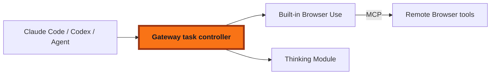

# Jev evaluations

Jev evaluates bounded state against typed questions. Use it to choose among observed options, score a rubric, or estimate the probability of a yes/no answer. It does not generate a conversational reply, grant permissions, or prove that an action succeeded.

The optional gateway service provides a single client for authorized agents, workers, API adapters and in-process features. Configure a direct TypeSafe connection or a compatible upstream. The gateway does not host the model or require any particular hosted platform.

## Configure a direct connection

Merge this fragment into your configuration:

```json
{
  "gateway": {
    "jev": {
      "enabled": true,
      "provider": "typesafe",
      "model": "jev-1.13.0",
      "apiKeyFile": "/path/to/private/jev.key",
      "allowedAgentIds": ["assistant"]
    }
  }
}
```

Store only the key in that file and restrict its filesystem permissions. Alternatively, set `apiKeyEnv` to the name of an environment variable available to the gateway process. Do not configure both references. Without either reference, direct mode reads `TYPESAFE_API_KEY` from the gateway environment.

Use a dedicated credential environment name such as `PRIVATE_JEV_TOKEN` or `GATEWAY_JEV_API_KEY`. Native CLI authentication/control names such as `ANTHROPIC_API_KEY`, `OPENAI_API_KEY`, `CODEX_HOME`, `HOME`, and `PATH` are rejected as `apiKeyEnv`. To reuse a native upstream identity, use the upstream resolver below instead of repurposing its environment variable.

The gateway removes the Jev credential variable from child-process environments after applying overlays: the configured `apiKeyEnv`, browser/thinking helper `apiKeyEnv` values, and `TYPESAFE_API_KEY` only when Jev is configured without `apiKeyFile` or `apiKeyEnv` (the variable it then reads). When Jev does not use a vendor name such as `TYPESAFE_API_KEY`, other tools and MCP connectors that rely on it keep receiving it. It also excludes them from generated MCP/Codex shell environment overrides and masks them when launching container processes. Previously configured variable names remain private during the current gateway process after a hot reload. Gateway-created capability/skill probes, native MCP adapters and managed safemode requests use the same filtering. Managed safemode CLI descendants inherit a names-only exclusion policy so gateway dotenv loading cannot restore filtered credentials. Native CLI authentication variables and independently launched terminal CLIs keep their existing behavior. Remove retired secrets from service environments before restarting; use a key file if you want to avoid inherited environment credentials entirely. This prevents automatic forwarding, not arbitrary filesystem access by a separately privileged host tool.

Direct requests use `https://api.typesafe.ai/v1/systemone` by default. Model versions and aliases come from the [TypeSafe model catalog](https://docs.typesafe.ai/models); choose a supported version deliberately. The result records the actual version reported by the provider.

## Configure a compatible upstream

An upstream owns its catalog, account routing, credential storage and billing. Model IDs are opaque: the gateway forwards prefixes and slashes unchanged and does not interpret them as a billing source.

To reuse the gateway's existing upstream identity:

```json
{
  "gateway": {
    "jev": {
      "enabled": true,
      "provider": "upstream",
      "model": "catalog-prefix/jev-version",
      "allowedAgentIds": ["assistant"]
    }
  }
}
```

The resolver selects an endpoint and credential **as one group**. If Claude settings contain any of `ANTHROPIC_BASE_URL`, `ANTHROPIC_AUTH_TOKEN`, `ANTHROPIC_API_KEY`, or `CLAUDE_CODE_OAUTH_TOKEN`, that settings group must contain both a URL and a usable credential. Otherwise, the same group is read from the gateway's inherited environment. An incomplete settings group is an error; it is never combined with another identity's environment values. This does not modify native CLI authentication.

For an independent compatible provider, configure both the endpoint and a credential reference:

```json
{
  "gateway": {
    "jev": {
      "enabled": true,
      "provider": "upstream",
      "baseUrl": "https://inference.example.com",
      "apiKeyEnv": "JEV_UPSTREAM_KEY",
      "model": "catalog-prefix/jev-version"
    }
  }
}
```

An explicit upstream `baseUrl` requires an explicit credential reference, and vice versa. URLs require HTTPS, except HTTP on `localhost`, `127.0.0.1`, or `[::1]` for local development. URL credentials, query strings, fragments and redirects are rejected. Tool callers cannot supply a URL or key.

The default compatible path is `/v1/jev/evaluate`. A base ending in `/v1` or the full evaluation path is also supported. A leading deployment path is retained. This is the gateway's compatibility contract, not a claim that every inference provider already implements it.

## Access, limits and reload

| Setting | Default | Meaning |
| --- | --- | --- |
| `enabled` | Off | Explicit opt-in |
| `allowedAgentIds` | All agents when omitted | Restrict access; an empty array allows none |
| `timeoutMs` | `5000` | Entire evaluation, including queue wait and credential resolution |
| `maxConcurrentRequests` | `4` | Shared active evaluation limit |
| `maxQueueSize` | `16` | Bounded number waiting for a slot |
| `maxInputBytes` | `131072` | UTF-8 JSON request size; excess input is rejected |
| `maxQuestions` | `64` | Maximum question count; no silent truncation |

Each agent can set `jev.enabled: false` to narrow global permission. An agent cannot expand the global allowlist. Existing task/ticket/agent access checks still apply. An evaluation grants no additional access to another agent's tasks, memory or browser sessions.

`gateway.jev` and agent Jev access settings reload live. Each new request captures its configuration; an in-flight request retains that model/connection generation. Access and global enablement are checked again before dispatch and before returning an answer. Revocation discards the decision, although a request already sent may still incur provider usage. Key files are read for each request, allowing rotation without restart. Changing a parent shell variable does not update the environment of an already running gateway.

There are no automatic retries or automatic switches to another billing source. A timeout or cancelled request does not establish that the provider did no work or charged nothing.

The `features` block accepts four enable flags: `computerTasks` (Computer Use connectors; on by default, set `enabled: false` to disable), `computerSteps` (step-by-step Computer Use), `browserTasks` (Remote Browser tasks through an installed adapter) and `browserSteps` (step-by-step Remote Browser commands). Any other key is rejected as invalid configuration. Enabling a flag does not install a browser adapter; see the sections below.

## Typed questions and answers

State and instructions accept text, a JSON object, or a JSON array. The service validates the full response against every question, including allowed options, probability ranges/distributions, score levels and nonnegative integer usage. Unexpected answer keys or missing answers fail the request.

```json
{
  "state": "The user wants to compare two options before deciding.",
  "questions": {
    "needs_decision": {
      "type": "noul",
      "instructions": "Does the user still need to make a decision?"
    },
    "next_step": {
      "type": "choice",
      "instructions": "What is the appropriate next step?",
      "criteria": {
        "explain": "Compare the options for the user.",
        "execute": "Execute a clearly authorized choice."
      }
    },
    "clarity": {
      "type": "score",
      "instructions": "How clear is the requested action?",
      "criteria": ["Unspecified", "Partially specified", "Fully specified"]
    }
  }
}
```

- **Noul:** `{ "type": "noul", "noul": 0.8 }`. The number is a yes probability, not a fabricated confidence field.
- **Choice:** chosen option, a probability for every option, and confidence. Supports 1–255 options.
- **Score:** probability-weighted score, indexed level probabilities, a legend, and confidence. Supports 2–10 levels.

Consumer policy belongs outside the client. Browser operation confidence, target confidence, skill relevance and progress filtering need different decisions and thresholds. A high probability is never authorization.

## MCP and worker access

Authorized orchestrators and workers can use `mcp__gateway__jev_evaluate` with `state` and `questions`. The gateway derives agent/session/task identity from authenticated runtime context; these fields, provider URLs, model overrides and keys are not tool arguments.

The same service is used for Claude Code and Codex workers, including app-container bridges. Vendor keys remain outside the container. Capability discovery and tool availability still depend on the current agent's permissions and process inventory; merely enabling Jev does not bypass those checks.

An external MCP server does not automatically gain access to another server's tools. Use the authenticated HTTP API with an agent-scoped write key, or inject an in-process evaluation callback into an adapter. Do not delegate an admin key.

## HTTP evaluation and usage

`POST /api/v1/jev/evaluate` requires an API key with write access to the specified agent, plus enabled Jev access for that agent. Evaluation is treated as a paid action. A read-only key cannot initiate it.

```bash
curl --fail-with-body http://127.0.0.1:10850/api/v1/jev/evaluate \
  -H "Authorization: Bearer $CLAUDE_GATEWAY_API_KEY" \
  -H 'Content-Type: application/json' \
  --data '{"agentId":"assistant","state":"Hello","questions":{"greeting":{"type":"noul","instructions":"Is this a greeting?"}}}'
```

Successful gateway response:

```json
{
  "requestId": "opaque-request-id",
  "requestedModel": "catalog-prefix/jev-version",
  "model": "jev-1.13.0",
  "answers": { "greeting": { "type": "noul", "noul": 0.99 } },
  "usage": { "input_tokens": 120, "output_tokens": 8 }
}
```

Optional `billing` contains `charged_credits` and an optional `rate_version`, as reported by the compatible upstream. These are not inferred from token counts or multiplied again by the gateway.

`requestId` is optional on requests: 1–256 printable ASCII characters without spaces, otherwise `JEV_INVALID_REQUEST`. Reusing an ID within the same caller scope is rejected rather than silently repeating a paid request. Only caller-supplied IDs enter the local ledger; it holds at most 4096 IDs (1024 per caller), each retained for five minutes, and is not durable across gateway restarts. Upstream IDs are hashed and caller-scoped. Durable deduplication and billing reconciliation belong to the upstream; a conflict response is not a cached answer.

Read usage with `GET /api/v1/jev/usage?agentId=assistant&limit=50&offset=0`. The API returns `{ "records": [], "total": 0 }` when no measurements exist. Read access to that agent is required. `limit` is 1–100 and `offset` is nonnegative. Usage records contain metadata, latency, outcome, model, reported usage and optional billing, never raw state, questions, DOM or credentials. The local store retains at most 10,000 records. Jev requests are separate from conversational context-window tokens.

The HTTP body may be up to 1 MiB plus a small envelope, so any configured `maxInputBytes` (at most 1 MiB) is usable; it is parsed only after authentication. A larger body returns HTTP 413 and a body that is not JSON returns HTTP 400, both with `JEV_INVALID_REQUEST`.

Errors expose a typed `JEV_...` code where the evaluation service handles the failure: invalid request/configuration, access denial, missing credentials, unsupported model, quota, rate limit, timeout, cancellation, provider failure, malformed response or request conflict. Safe retry/reset headers are retained when supplied; raw provider error bodies are not exposed because they can contain submitted state or credentials.

## Compatible upstream wire contract

The gateway sends this provider request, authenticated with the selected upstream credential:

```json
{
  "request_id": "caller-scoped-request-id",
  "model": "catalog-prefix/jev-version",
  "state": "Hello",
  "questions": { "greeting": { "type": "noul", "instructions": "Is this a greeting?" } }
}
```

The compatible upstream returns native `model`, `answers`, and `usage` in the TypeSafe shape, plus `request_id` and `requested_model` to identify the submitted request. Optional billing uses the shape above. Extra provider-specific routing metadata is not exposed as authorization. Direct TypeSafe requests contain only `model`, `state`, and `questions`.

The gateway distinguishes native version from requested catalog ID. A prefixed catalog identifier must never be replaced with an unprefixed native model before upstream routing.

## Browser tasks with an installed adapter

Gateway owns authorization, task scheduling, cancellation, durable receipts and Jev evaluation. Browser Use is included in Gateway (`src/automation/browser-use.ts`); it owns observation interpretation, decisions, lease handling, stale recovery and action selection. Remote Browser provides the MCP tools. No separately installed adapter or module path is configured.

Merge the following into an enabled Jev configuration:

```json
{
  "gateway": {
    "jev": {
      "enabled": true,
      "provider": "typesafe",
      "model": "jev-1.13.0",
      "apiKeyEnv": "PRIVATE_JEV_TOKEN",
      "features": { "browserTasks": { "enabled": true } },
      "browser": {
        "bindings": [{
          "id": "approved-browser",
          "name": "Approved browser tab",
          "agentId": "assistant",
          "principalId": "authenticated-principal",
          "conversationId": "orchestration-conversation-id",
          "endpoint": "https://browser.example/mcp",
          "apiKeyFile": "/path/to/private/browser-controller.key",
          "scope": { "device_id": "device", "grant_id": "approved-grant", "tab_id": "tab" },
          "fields": [{ "label": "Name", "text": "Explicit user-supplied value" }],
          "budget": { "maxSteps": 20, "maxEvaluations": 30, "timeoutMs": 120000 }
        }]
      }
    }
  }
}
```

The built-in Logic receives goal, exact scope, explicit fields and budgets. Gateway injects MCP calls, Jev evaluation, Thinking and progress. Without independent verification, completion remains a candidate for parent verification; missing field values are handed back to the parent. Provider credentials remain host-owned.

Each binding belongs to one agent, principal **and orchestration conversation**. A conversation ID is not the native CLI/session ID; obtain it from the authenticated orchestration task/conversation data. Browser device/grant/tab values must come from an already approved browser session. Setting a binding does not grant consent. Manual bindings and task receipts remain private to their configured principal/conversation. Automatic discovery follows the existing connector-sharing policy: every user of an enabled shared agent/connector can discover its relay-approved tabs and receives a separate binding. These bindings do not make the underlying shared browser private; use separately scoped connectors or manual bindings for isolation. The gateway checks exact binding ownership before dispatch and callbacks; the extension/relay must independently enforce actual-tab ownership, grant, lease and observation freshness at execution.

The connector uses authenticated Streamable HTTP MCP, accepts HTTPS or loopback HTTP only, refuses redirects and does not expose credentials to agents or app containers. Choose one `apiKeyFile` or dedicated `apiKeyEnv`; browser credential environment variables are stripped from managed children just like Jev credentials. Removing/changing a binding or disabling permissions fences active work; a bounded best-effort lease release may still occur. Credential changes take effect on the next connection. Runtime code/module updates require restart.

Agents discover their targets with `capabilities_list(scope="browser")` and submit through `task_spawn(target_profile="gateway-managed", gateway_target={adapter:"browser",session_id:"approved-browser"})`. This uses the same task tracking and completion delivery as other managed work. App agents receive scoped task tools through their bridge, not the MCP controller key, a host shell or safemode permissions. Newly enabled capabilities may require a fresh CLI process inventory.

### Results, recovery and reporting

- `succeeded / VERIFIED` becomes completed only when the adapter's trusted independent verifier passed and permission remains valid.
- `blocked / FIELD_TEXT_REQUIRED` uses the existing task question flow. The parent receives the missing field label when available. Answering is a new authorized bounded attempt; old element refs are not replayed. For an unambiguous missing field, the gateway binds the authenticated task answer to that field label and supplies its exact text to the fresh run. Previously answered fields remain available. Ambiguous labels require parent inspection; no stale element reference is reused. Answers longer than 2,000 characters are rejected before browser dispatch.
- `needs_verification` and other bounded handoffs require parent reconciliation. Keep the exact reason rather than pretending that DONE proved completion.
- Any unknown mutation outcome takes precedence, including after cancellation. Preserve operation IDs; do not replay automatically.
- Confirmed cancellation stops the request. A adapter ignoring cancellation is bounded by a watchdog and remains uncertain, not confirmed stopped.

A durable running receipt is written **before** dispatch. A running receipt found after restart becomes `BROWSER_EXECUTION_INTERRUPTED`; no second action is sent. Each private receipt retains the bounded observation and full result for authorized local investigation. Raw page observations are not copied to default logs or conversational token usage. Task status, dashboard detail and channel task detail expose outcome/reason, action/evaluation counts and safe correlation metadata. Jev records link evaluations to agent, session and task independently of conversational model usage.

### Integration validation

`scripts/jev-browser-smoke.cjs` exports `runGatewayBrowserFixture(options)` for a browser project's isolated fixture. It executes the **actual gateway task controller, durable adapter, built-in Browser Use and authenticated MCP connector**. The caller supplies an installed public entrypoint, approved fixture scope, controller credential file, goal/fields and evaluator callback. Use real relay/extension/browser fixtures; fake MCP tests alone do not prove end-to-end integration. No paid inference is performed without an explicitly injected live evaluator.

Test verified effects, missing field input, absent/false verification, stale rejection, uncertain mutations, cancellation/revocation/disconnection, gateway restart, cross-agent/principal/conversation denial and app-agent isolation. Test direct/upstream managed/BYOK accounting separately with live credentials. Do not claim comparative token savings or production browser reliability from a small synthetic sample.

## Check readiness and troubleshoot

Run `claude-gateway doctor` after editing configuration. When Jev is enabled, its local check validates the configuration and checks referenced credential-file readability/size or the direct credential environment reference. It does not prove upstream authentication or perform paid Jev inference. Use the bounded HTTP example above when you explicitly want to test the configured provider end to end.

- **Configuration rejected:** check the provider/model, numeric limits, credential reference and complete endpoint/credential group.
- **No tool:** check global enablement, `allowedAgentIds`, agent disablement and the current runtime's tool inventory.
- **Authentication failure:** verify the file/environment is readable under the gateway's service user. A key configured only in an interactive shell may not exist in the service environment.
- **Quota or rate limit:** inspect the upstream account and supplied retry/reset metadata. The gateway does not switch to a different account automatically.
- **Malformed response:** verify that the upstream implements structured evaluation rather than returning a chat completion or event stream.
- **Browser did not complete:** inspect handoff/unknown outcomes and independent evidence. Do not turn `needs_verification` into success or retry an uncertain mutation automatically.

## Bind an existing MCP connector to a conversation

Browser bindings can reference an already connected HTTP MCP connector using `connectorId`, instead of `endpoint` plus `apiKeyEnv`/`apiKeyFile`. These forms are mutually exclusive. Gateway uses its existing connector secret store and per-agent enablement; it never copies the resolved credential into the binding, task arguments or API response. The HTTP connector must use an Authorization header and a secure endpoint (HTTPS, or loopback HTTP for local fixtures). Other header-based authentication schemes are currently rejected explicitly.

An administrator configures `gateway.jev.browser` with `bindings: []`, enables `features.browserTasks.enabled`, and grants the agent Jev access. Installing code or selecting executable modules is not exposed to conversational tools or these APIs.

All routes below are under `/api/v1/agents/:agentId/sessions/:sessionId`:

| Method and suffix | Behavior |
| --- | --- |
| `GET /browser-bindings` | List bindings for the authenticated principal and existing active conversation. No credentials or page content. |
| `POST /browser-bindings` | Admin-only: create an approved tab binding from an existing enabled connector. |
| `DELETE /browser-bindings/:bindingId` | Admin-only: remove that scoped binding and fence ongoing access. |
| `GET /tasks/:taskId/browser-evidence` | Read the scoped task's retained receipt/observation; never invokes inference. |
| `GET /tasks/:taskId/browser-evidence?refresh=true` | Inspect the currently approved tab and retained operation ID without replaying an action. |

The evidence routes return HTTP 400 `INVALID_REFRESH` when `refresh` is not `true` or `false`, HTTP 503 with the code (`BROWSER_EVIDENCE_UNAVAILABLE`, `BROWSER_INSPECTION_UNAVAILABLE` or `ORCHESTRATION_DISABLED`) when evidence cannot be read right now, and HTTP 403 `BROWSER_EVIDENCE_UNAVAILABLE` for any access or ownership failure.

Example POST body:

```json
{
  "connectorId": "paired-browser",
  "name": "Approved research tab",
  "scope": { "device_id": "device", "grant_id": "grant", "tab_id": "tab" }
}
```

The server derives principal and conversation from the authenticated API key and session membership. It rejects caller-supplied identity, endpoint, secrets and executable configuration. A missing or ambiguous active conversation is rejected: start the conversation first. Admin authority does not bypass its session membership. The API confirms the approved scope with a bounded leased observation before persisting the binding using the shared config-write lock. This never requests new consent after Stop/revoke. The lease is released after inspection; an occupied or revoked tab fails closed. No model evaluation is made by binding or inspection.

Create bindings only after the external browser's normal user consent flow. List/select device, grant and tab through the existing connector's resource UI. The control plane owns that UI and installation/version pinning; Gateway remains independent of any browser product. Use the same stable API-key identity as the conversation. Connector removal, disabling, endpoint/header changes or credential rotation invalidate running binding identities. New attempts resolve current credentials. Removing one binding does not disconnect the underlying connector or other approved conversations.

### Parent verification and recovery

The parent agent can call `task_status` with `task_id` and `browser_evidence: "recorded"` or `"fresh"`. Evidence is explicitly requested rather than injected into every task index. It is private, bounded, untrusted page data, not instructions. Fresh inspection uses a short-lived tab lease and returns an `evidenceId`; it also reads `operation_status` only for the operation ID in the task's durable receipt. Interrupted receipts can still inspect the page, but their unknown state never becomes permission to repeat an action or confirm completion.

For a finished `COMPLETION_CANDIDATE` or `VERIFICATION_FAILED` request, the parent independently compares the fresh observation with the complete user goal. If verified, it calls `task_update` with:

- `mode: "verify_browser"`, `task_id` and the current `expected_revision`;
- `expected_request_id` and `evidence_id` from the fresh evidence response;
- `instruction`: concrete evidence establishing the goal, not merely the adapter's DONE decision.

Proof expires after five minutes and is tied to the task/request. Current permissions, decision epoch, execution authorization and revision are checked. Confirmation is idempotent and releases the task slot, records parent verification separately from the adapter verdict, and delivers normal completion. Unknown mutations, interrupted executions, unsupported goals and missing/expired evidence are rejected. If the parent cannot verify the goal, it must report the limitation and reconcile; this command cannot trigger new browser actions. This is parent-assessed verification, not a universal deterministic website verifier. Administrators may still install deterministic verification/text-helper hooks for supported workflows.

App agents use the same scoped task bridge and verification flow when browser capability is enabled. Workers gain no binding administration, host shell or controller secret from it. Direct HTTP evidence reads enforce agent/session/principal ownership; revocation during a read prevents returning its result.

Structured Jev failure codes, HTTP status, reset time and retry-after metadata are retained on `browserReport.providerFailure`; raw upstream prose is not copied. Task status and dashboard show the bounded reset/retry information. There is no automatic action retry or billing-source fallback.

### Mutation checkpoints and crash inspection

Before sending a page mutation over MCP, Gateway synchronously persists its operation ID, tool name and timestamp in that task request's receipt and flushes the file and directory. A failed checkpoint prevents dispatch. This fence runs in the transport, not the adapter's best-effort progress callback; it stores no page arguments, field values, credential or lease token.

`browser-evidence` and `task_status` evidence include `lastDispatchedMutation` when available. It means **dispatch was prepared**, not that the browser completed the action. After abrupt process termination, fresh inspection uses this retained operation ID even when no terminal adapter result exists. Inspection may need to wait for the dead process's tab lease to expire. A missing or expired browser operation record remains unknown; neither a checkpoint nor a completed single operation establishes that the entire user goal succeeded. Interrupted requests cannot use `verify_browser` and are never automatically replayed. A terminal adapter result that omits or contradicts the latest dispatched operation is also retained as unknown.

For isolated integration fixtures, `scripts/jev-browser-crash-smoke.cjs` exports `runGatewayBrowserCrashFixture`: inject a trusted installed adapter, approved fixture scope, deterministic evaluator and an assertion on the browser's observable effect. It kills a child running the production task adapter and MCP transport after the real browser response exists but before the adapter receives it, then reconstructs the adapter, inspects the durable receipt, waits for lease expiry and checks the exact operation without replay. This does not kill a production gateway daemon or simulate power loss.

`runGatewayBrowserFixture` in `scripts/jev-browser-smoke.cjs` also accepts an optional trusted local `containerImage`. It exercises the app-agent Unix-socket bridge from actual isolated Docker processes: discovery, task submission, fresh evidence and parent verification, plus foreign-principal and host-only capability denial. The fixture container receives only its temporary workspace/ticket/socket, with no network or provider credential mount. Inference and parent assessment remain deterministic test callbacks; this is not a live-model app deployment benchmark.

Independent verification must return a boolean. `false` means the goal was not verified; strings, objects, null or undefined are contract errors (`INVALID_CONTRACT`), never converted into a normal negative result. The same rule applies when Gateway wraps an optional verifier for the built-in Browser Use.

### Default Remote Browser routing

When Jev and `features.browserTasks.enabled` are enabled and `browser`
is configured, conversational agents route Remote Browser work to Gateway-managed
browser tasks by default. They discover targets with `capabilities_list` using
`scope: "browser"`, then use `target_profile: "gateway-managed"` and the returned
`gateway_target` (`adapter: "browser"`, `session_id`). Direct MCP workers are not
an automatic fallback when Jev or browser access is unavailable.

For enabled Remote Browser connectors, discovery reads the authenticated relay's
approved grants and creates stable targets scoped to the agent, principal and
conversation. No manual per-session config entry is required. A writable turn may
request extension approval for a single online unapproved device; approval remains
with the browser owner. If approval is pending, approve it and discover again.
Multiple browser targets must be selected explicitly. Offline, expired, unapproved
and read-only grants are not offered as executable targets.

When Computer Use is also enabled, both can drive Chrome on the user's Mac. The
agent chooses from the latest user request: Remote Browser, the shared tab or the
extension selects Remote Browser; Computer Use, the Mac, the desktop or a native
application selects Computer Use. An open task of either kind does not by itself
select its environment for a new request. A browser or website request that names
neither gets one short question first ("Remote Browser on your Chrome tab, or
Computer Use on your Mac?"), and the answer is reused for related follow-ups.

Discovered targets are stored in the agent's orchestration directory as
`browser-bindings.json`, without connector credentials. Manual bindings remain
supported. Connector enablement/credentials and relay permissions remain authoritative
at execution time. Discovery alone does not run Jev or prove task completion;
completion requires fresh browser evidence and parent verification.

To open a specific website (including from Chrome New Tab), include
`gateway_target.start_url` with the user-requested HTTP(S) URL. Gateway passes it
as the adapter's `startUrl`. Navigation acquires the approved-tab lease and records
a durable operation ID before dispatch. A lost navigation response is unknown and
is never automatically replayed. Supplying field answers resumes the current page
without repeating initial navigation. Without a URL, an internal New Tab reports
`START_URL_REQUIRED` instead of an observation-schema error.

Browser tasks that stop at a known decision boundary (for example low confidence or incomplete observations) fail without retaining a target lock when all dispatched mutations are confirmed. Unknown mutation or provider outcomes still require reconciliation. No automatic mutation replay occurs. The browser adapter briefly refreshes empty SPA observations before making an evaluation; a persistently empty page stops without a paid decision.

### Continuing a browser task

Use `task_update` with the existing task ID, `expected_revision`, `mode: when_ready`, and the complete revised goal for related follow-up instructions. Do not spawn another task that waits on the same tab. The gateway persists the revision across restarts and lets the active request settle before starting a new attempt. A completed or failed Gateway-managed task can be reopened by its owner in the same conversation. Cancelled tasks and uncertain mutations remain fenced. Browser continuations start with a fresh observation of the current tab; the original `start_url` is not replayed. A revision accepted before the first dispatch still uses that initial URL. `/tasks`, API task details, and the dashboard expose pending revisions separately from the currently applied revision.

### Missing field values and confidence stops

For a browser task paused with `FIELD_TEXT_REQUIRED` (`reason: missing`), the parent
agent should use `task_answer` with facts already supplied by the user. This is
also permitted in the notification assigned to that exact pending question, for
the owning principal and conversation only. It does not authorize new work,
consent, unrelated task answers, or ambiguous field values. Ask the user only
when information is missing or a new decision is required. The answer resumes
the existing task; do not spawn a continuation task.

`LOW_TARGET_CONFIDENCE` means the adapter declined to act on its chosen page
target. It is not a provider outage or proof that the requested result exists.
Inspect fresh page evidence before revising the same task with `task_update`.
The adapter now defaults to validated argmax choices, as in jev-ultrafast. Confidence is telemetry; operators may explicitly configure stricter operation/target gates. Do not lower an explicitly configured gate to work around a failed task. Gateway records bounded
`browser.decision` events with the measured operation and target confidence for
future diagnosis; these events do not contain page text or field values.

Jev may return probabilities rounded to hundredths whose sum is 0.99 or 1.01.
The response validator accepts this rounding envelope (0.005 per option, capped
at 0.02 total); full-precision distributions retain the 0.001 tolerance. It keeps
provider probabilities and confidence unchanged and still rejects missing
options, invalid values and a selected option that is not a maximum. Invalid
responses record a fixed `validationReason` code in evaluation/task diagnostics,
without recording request text, credentials or provider prose.

### Parent recovery instead of error-only replies

An assigned browser task notification can replan a known, non-mutating stop
(low operation/target confidence, stale-page budget, unavailable page content,
or model blocked) through `task_update` with `mode=when_ready`. The parent should
inspect fresh browser evidence first and supply concrete next-step guidance.
The original goal, field answers, owner, target and authorization are retained;
notification guidance cannot create another task or replace the original goal.
Three distinct replans are allowed per user-directed revision chain; repeated
identical guidance is rejected. A new user update starts a new chain.

The assigned parent can also independently verify a completion candidate using
fresh evidence, including after a low-confidence stop when the requested result
is already visible. If a completion candidate is premature, the parent can
replan within the same task and the same bounded recovery budget. These rules
use task state and evidence, never domain-specific selectors or website names.
Unknown mutations, cancelled work, provider failures and revoked
authority do not qualify for autonomous replanning. Ask for genuinely missing
information or a required decision; do not use raw error codes as the final
response when the parent can still resolve the task.

### Isolated automation regression scenarios

Run `npm run build`, then
`node scripts/jev-automation-fixtures.cjs /absolute/path/to/browser-adapter.js`.
This uses the built-in browser controller with real Gateway task persistence,
question suppression/review, replanning and verification, while replacing the
browser with synthetic pages. It covers flight search (including passenger
constraints), matching phone-case search, and asking ChatGPT for attributed news.
Each runs normally and with low confidence, stale observations, premature
completion candidates and unknown
mutation outcomes. Known facts must not cause user questions; unknown mutations
must not be replayed; all continuations retain one task.

Default parent and Jev decisions are scripted regression fixtures, not evidence
of model intelligence. Set `JEV_FIXTURE_INFERENCE` to a trusted local module
exporting `evaluate(request,signal)` and `parent(input)` to run paid live inference
on those same synthetic pages. Reports label live versus scripted decisions.
These simplified pages do not establish compatibility with the actual Google,
Shopee or ChatGPT UI, authentication, anti-bot challenges, or real result quality.
No real purchases, bookings or ChatGPT submissions are made by this harness.


### Continuous execution and text helper

The adapter observes and acts inside one task, without waking the conversational agent for each action. Configure the shared `gateway.jev.thinking` connection for tool-free field generation (and future Thinking consumers):

```json
{"baseUrl":"https://models.example/v1","model":"your-small-text-model","apiKeyEnv":"JEV_TEXT_API_KEY"}
```

The default API is `openai-chat` (`/chat/completions`, `Authorization: Bearer`); set `api: "anthropic-messages"` for `/messages` (`x-api-key`). Each call allows up to 4096 output tokens, enough for a 2000-character field value. `baseUrl` includes the API version path, e.g. `/v1`. An absolute `apiKeyFile` may replace `apiKeyEnv`. Credentials remain in Gateway and are excluded from CLI children. The helper receives goal, selected field, page context and recent actions and returns only `{text:string|null}`. Null means missing information; the parent can answer from conversation or ask the user. Provider/parse failures never become invented text. Without this config or a trusted installed hook, missing fields still go to the parent. Config reload replaces and fences affected bindings.

Runner confidence gates default to zero (validated argmax); explicitly configured positive gates remain supported. Consent, sensitive-field restrictions, observed target validation, stale checks, durable mutation receipts, budgets and independent final verification remain enforced. The parent reviews completion and real blockers rather than each ordinary action.


### Gateway-owned controller stack

Gateway includes its own browser controller. No remote-browser runner/adapter package or module-selection setting is needed. Configure `browser: {bindings: []}` for automatic discovery, or explicit bindings as described above.


```mermaid
flowchart LR
  Agent[Claude Code / Codex / Agent] --> Core[Gateway task controller]
  Core --> Logic[Built-in Browser Use]
  Logic -->|MCP| Browser[Remote Browser tools]
  Core --> Thinking[Thinking Module]
  classDef core fill:#f97316,stroke:#9a3412,stroke-width:4px,color:#111827,font-weight:bold;
  class Core core;
```

Browser Use owns candidate generation, Jev decisions, field assistance and bounded recovery. Core owns Thinking timeout/cancellation/budgets through `LoopContext.think()`. Gateway injects scoped model/tool connections and checkpoints. The extension/relay remain tool providers with no provider credentials or decision loop.

Upgrade pre-release installations by removing the old module-selection property and uninstalling the old runner/adapter package. Unknown configuration keys are rejected. Existing bindings, scopes and durable task receipts are preserved. The agent-facing MCP call is bounded request/response; Gateway owns persistence/reconciliation. Arbitrary MCP tool discovery and standalone durable background jobs are not implied.

### Partial observations and browser recovery

Dense pages may return a partial control list. Browser Use can operate on known,
guarded targets to narrow the page, while completion still requires fresh evidence.
Task notification turns explicitly include `OBSERVATION_TRUNCATED` and `NO_PROGRESS`
in the existing bounded, same-task recovery flow. The agent must commit the update
before claiming a retry is queued; provider failures, cancellation and unknown
mutations remain excluded from automatic recovery. An unchanged page alone does
not prove a website is blocking automation.

### Remote Browser direct commands and step mode

While the user controls a Remote Browser task (the default after spawn), each
command runs as a direct command, as for Computer Use. An unambiguous command
maps to one extension primitive without a Jev round-trip; anything else gets one
Jev decision over the observed controls and dispatches at most one action.

- `scroll ลง`, `เลื่อนขึ้น`, `scroll down`, `page down`: `page_scroll` with the
  observed `generation`. At the top or bottom nothing is sent (`SCROLL_LIMIT`).
- `enter`, `กด tab`, `esc`, `ลูกศรลง`, `backspace x3`: `page_keypress` (native
  key codes, so Enter submits and Tab moves focus).
- `กลับ`, `ย้อนกลับ`, `ย้อนกลับไปหน้าก่อนหน้า` (and the same with or without
  `ไป`/`หน้าก่อน`/`หน้าที่แล้ว`), `back`, `go back to the previous page`,
  `ไปข้างหน้า`, `forward`: `tab_history`. When
  `observation.navigation` says there is no such entry, nothing is sent and the
  command reports `HISTORY_UNAVAILABLE`; the extension's own `HISTORY_UNAVAILABLE`
  rejection is recorded as not executed, never as an unknown outcome.
- `ค้นหา X`, `search X`: `page_type` with `submit: true` (text and Enter under one
  operation ID) into the only search-like field. With several editable fields,
  one Jev question chooses the field. In step mode, submitting into a field that
  is not search-like is fenced (see below).
- `เข้า google`, `เปิด youtube`, `go to example.com`, a bare URL: `tab_navigate`
  in the bound tab.
- **Named sites.** A navigation the grammar does not cover (`เข้าเว็บไซต์ Yahoo`,
  `งั้นเปลี่ยนไปเข้า yahoo`) goes to Jev, which may choose `NAVIGATE`. It is
  offered only to a single direct command that has not acted yet, when the host
  has a text helper. The text helper (the same one that fills field values)
  turns the command into an address from the command and the current site
  (origin) only, never the page title, path, query or text. There is no site list. The address must be
  `http`/`https` or a bare domain, with no credentials, IP address, `localhost` or
  single-label host; any other scheme (`javascript:`, `data:`, `file:` ...) is
  refused. A refused or unresolved address dispatches nothing
  (`NAVIGATION_UNRESOLVED`), and an uncertain `NAVIGATE` is
  `LOW_OPERATION_CONFIDENCE`. Otherwise `tab_navigate` opens it in the bound tab.
- `อีก`, `again`: repeats the previous command, decided afresh on the current
  page. The previous command, what it did and the page it ended on are passed to
  Jev as reference context only.
- `พิมพ์ X` / `type X`: when Jev chooses a field, `X` itself is the text (never
  generated text). A direct command types only when it starts with a text-entry
  verb (`พิมพ์`, `ค้นหา`, `กรอก`, `ใส่`, `type`, `search`, `fill` and so on). If
  Jev chooses to type for any other command, for example the page's own audio
  heard as a command, nothing is typed (`TEXT_ENTRY_NOT_REQUESTED`).
- **New tab.** A binding is one user-approved tab. `เปิด tab ใหม่`, `new tab`,
  `เปิดแท็บ Google ใหม่`, `เปิดแท็กใหม่` (as speech recognition often hears it) and
  `Cmd+T` do not open another tab (`tab_open` is not allowed): that would widen
  the approved scope silently. The command answers `NEW_TAB_OUT_OF_SCOPE` and the
  next command (for example `เข้า google`) runs in the approved tab. In step mode
  the step is recorded as a note and the run continues in the same tab.
- **Covered targets.** When something covers the chosen link or button (the
  extension's `STALE_OBSERVATION` with cause `TARGET_OBSCURED`), the page is not
  changing, so a direct command is not retried. It reports `TARGET_OBSCURED`
  (spoken as "something is covering that button or link") instead of using up
  the stale-read budget as "the screen is changing". An agent task may still
  choose another control, such as closing the overlay. If its stale budget runs
  out on a covered target, it ends as `TARGET_OBSCURED`. A real page change
  before input is still re-read and retried as before.
- **High-impact controls.** Clicking or selecting a control whose label, value or
  context names delete, send, submit, pay, buy, publish, quit or confirm (English
  or Thai) needs a command that names the same operation and a Jev confidence of
  at least 0.85. Otherwise nothing is dispatched
  (`DESTRUCTIVE_ACTION_CONFIRMATION_REQUIRED`).
- **Outcome line.** Each settled command sets the task progress text to `Done:
  …` (for example `Done: searched in "Search"`) or `Not done: …` with a hint.
  A not-done command dispatched nothing; the session keeps waiting for the next
  command instead of failing. This includes a Jev decision that timed out or was
  invalid (`ADAPTER_TIMEOUT`, `DEADLINE_EXCEEDED`, `INVALID_RESPONSE`,
  `INVALID_DECISION`, provider unavailable or rate limited), on Remote Browser
  and Computer Use alike: only that command is not done, and queued commands
  still run. Jev configuration, access and quota failures still stop
  the task. An invalid Jev answer records which check failed
  (`validationReason`, for example `DISTRIBUTION_SUM`) in the report and the
  gateway log, never the answer itself. When the extension confirmed the action but the
  next page did not settle within the stale-read budget, the line is still
  `Done: …` and adds that the page was still loading. When the receipt for the
  last action is missing, the line starts with `Unknown:` (the action may have
  run) and nothing is repeated.
- **Action log.** Each settled round also appends its outcome line (and, for a
  step run, the last completed action, such as `pressed "All Clear"`) to the
  task's `actionLog`, the last 12 rounds with short command and result text.
  For a correction the command is the user's latest words; text a command types
  is logged as `[text]`.
  `task_status` and the per-turn task context include it, so a summary after many
  commands reports what each round did rather than only the latest one.
- **Rapid commands.** Commands typed while the previous one is running are
  queued first-in, first-out (up to 20) and delivered verbatim, exactly as for
  Computer Use. Speech on the live voice session while the user's previous
  command runs joins the same queue instead of pausing it. Pausing, or handing
  control to the agent, drops queued commands and the progress text lists those
  not sent. A settled round is applied at once and the next command
  dispatched without waiting for the next poll.
- **Replaced sessions.** A new spawn for the same tab replaces a session that
  failed before any tab action; a session that acted still needs `task_update`
  or `task_cancel`.

`page_keypress`, `tab_history` and `page_type` `submit` need Remote Browser
extension 0.3.5+, which also reports `observation.navigation` and
`truncated.title/url`. Without `navigation` in the observation, keys report
`KEY_UNSUPPORTED` and back/forward and search use the normal Jev decision
instead. A leased read after a navigation may fail with `STALE_OBSERVATION`
cause `NAVIGATION_PENDING`; Gateway re-reads with a short backoff (its own
budget of six reads) and never replays the action. Fresh inspection reads retry
the same way.

Set `features.browserSteps.enabled: true` (default: off, live reload) to run the
user's own step list, for example
`เปิด tab ใหม่, เข้า google, ค้นหา แมว, เข้า link แรก, scroll ลงมา`, on one tab
lease. The grammar is the one described in
[Step-by-step commands](#step-by-step-commands): the user's initiating message is
used verbatim when it is a step list, at most 12 steps within 120 seconds. Each
part is one direct command as above with the strict high-impact fence (every
high-impact control, including a generic `OK`, returns control). The page does
not report keyboard focus, so a bare `enter` step, or a search step whose field
is not search-like, returns control when the field or any control on the page is
high-impact (for example a `Send` button); search boxes submit as usual. A
binding's `budget.maxSteps` / `budget.maxEvaluations` bound the whole run (each
part still takes at most 3 actions and 6 decisions); reaching them stops with
`ACTION_BUDGET` / `EVALUATION_BUDGET`. After each
action the page is compared with the state before it, polling a few fresh reads
while a navigation commits; scroll and key steps without a visible change are
listed in `unverifiedSteps`. A step that finds nothing right after an earlier
step is re-observed up to twice; nothing was dispatched, so no action repeats.
`browserReport.stepRun` has the same `stopReason` values, `doneParts` and
`remaining` as Computer Use, plus `notes` (for example the kept tab).
Answers to field questions keep the one-command path.

## Fresh-state decisions

Browser Use and Computer Use select actions with Jev using fresh MCP observations.
Experience Packs and learning have been removed: no registry downloads, stored
hints or learned rules are used. Remove the former `gateway.jev.experience` setting
from existing configuration. Existing experience cache directories are unused.
Thinking remains available for field text and independent completion verification. Computer control always starts with Jev; low confidence or three consecutive ineffective observations may invoke one screenshot-backed Thinking action. A stale decision is discarded before dispatch. The Mac app cannot override provider routing. Thinking/provider errors are reported as blockers, not missing-input requests. A new explicit command can resume a known stopped round; unknown mutation outcomes still require reconciliation.
Task ownership, consent and durable mutation receipts are unchanged.

## Computer Use connectors

Computer Use runs the built-in computer controller as a Gateway-managed task. Add an
HTTP MCP connector with `resourcesPath: "/v1/computer-grants"` and the paired
controller credential in the normal connector secret store. The device owner
must separately approve applications and access duration; pairing alone does
not authorize actions. Neither Jev nor Thinking credentials are sent to the
computer or its relay.

With Jev enabled and the agent permitted by `allowedAgentIds`, computer tasks
are available by default; set `features.computerTasks.enabled: false` to disable.
The shared `gateway.jev.thinking` supplies field text and independent completion
verification. Without a Thinking helper, unknown field values require input and
completion candidates are never reported as verified success.

### Step-by-step commands

Set `features.computerSteps.enabled: true` (default: off) to run an explicit step
list without returning to the parent agent after each step, for example
`เปิด tab ใหม่, เข้า google, ค้น cats, เข้า link แรก, scroll ลงมา`. A numbered or
bulleted list yields exactly its items; text before the list, such as a role
sentence or a `Steps:` header, is ignored. Otherwise steps are split on commas, new
lines, and the Thai connectors `แล้ว` and `จากนั้น` (when preceded by a space),
after dropping a leading `You are ...`/`คุณกำลัง ...` context sentence, a
header line ending in `:`, and an inline header such as
`ทำตามขั้นตอนนี้ทีละขั้น: a, b` (a colon followed by a space; URLs and times are
never headers). Pacing notes such as `start with step 1` or
`เริ่มจากขั้นตอนที่ 1` are ignored. Quoted text is never split. Text after a list,
mixed numbered and bulleted items, conditional wording anywhere, a single
step, more than 12 steps, or a step over 300 characters keeps the normal
one-command path. Answers, recovery notes and agent-prepared field values also
keep the normal one-command path.

When the user's own message that started the round contains a step list, that
list is used verbatim instead of the parent agent's rewritten goal; the agent
goal is used only when the user's message is not a step list. Direct control
text and later continuations of the same message never reuse it.

One desktop lease is held for the run. Each step is handled as a direct command:
Jev chooses only from observed controls, and typed text comes only from that
step's own words. Exact scroll, key and back/forward commands skip Jev, and so
do the browser shortcuts below. A listed step that joins commands with `แล้ว`,
`จากนั้น` or `then` (for example `เปิด Chrome แล้วกด Cmd+T`) runs each part in
order and completes only when every part took effect; when it stops part-way,
`stepRun.doneParts` lists the parts already done. After each part, the
accessibility tree is compared with the state before the action. If a step finds
no matching control, for example a results page still loading or a window
still opening for the first step, it is re-observed up to twice before stopping; nothing was
dispatched, so this never repeats an action. Screenshots are captured only when
the run stops.

The run stops and returns control, with `computerReport.stepRun` giving the
completed steps, `stopReason` and remaining steps, when:

- a Jev decision is below the confidence threshold, is ambiguous, or needs text
  (`STEP_NOT_EXECUTED`)
- a step's wording or chosen target is high-impact, such as send, submit, delete,
  trash, quit, pay, buy, confirm or a dialog OK (`DESTRUCTIVE_STEP`,
  `DESTRUCTIVE_ACTION`). These steps are never dispatched automatically, and the
  parent agent must get explicit user confirmation. A step that only checks the
  page, such as `confirm the page has loaded` or `ยืนยันว่าหน้าโหลดแล้ว`, is not
  high-impact; the agent is told not to add such steps at all
- an action produces no observable change (`STEP_NO_EFFECT`). Up to three
  boundary scrolls in a row are tolerated and listed in `unverifiedSteps`
- an action outcome is unknown (`OUTCOME_UNKNOWN`). This uses normal
  reconciliation and never replays the action
- the 120-second run limit is reached (`TIMEOUT`), or all steps are done
  (`ALL_STEPS_DONE`)

1. Call `capabilities_list` with `scope: "computer"` to discover ready devices.
2. Submit `task_spawn` with `target_profile: "gateway-managed"` and
   `gateway_target: { "adapter": "computer", "session_id": "<discovered ID>" }`.
3. Use normal task status, updates, answers, and cancellation. Related changes
   use `when_ready`; an active request settles before the new revision begins.

Targets are bound to the authenticated agent, principal and conversation. App
container agents use the same host-managed executor without receiving provider
keys or access to host safemode. A disabled connector, revoked membership or
local device consent prevents new actions. Receipts are durable before dispatch;
unknown effects after interruption remain fenced for reconciliation, never
silently replayed. Task details expose Computer Use outcome, reason and action
count; these counters do not prove goal completion.

The desktop observation may include bounded static text and a window title, as
well as interactive controls. These are untrusted application content and do
not authorize further actions. `NO_SUPPORTED_ACTION` means no offered next action
was selected; it must not be described as an account or provider rejection.
Known native tool error codes are preserved in task failures instead of being
replaced with a generic tool failure. Action counts represent desktop commands,
not screenshots or proof that the goal was achieved.

Computer field requests include their application, window and field identity before
question notifications are emitted. The agent can answer an assigned missing-field
question from existing user instructions; it should ask the user only for an unknown
required fact. Thinking generates literal field data, validates its meaning and
retries an invalid candidate before any typing. A capability disclaimer is not a
field value. Known answers are reused only for a uniquely matching scoped field.

After restart, queued computer work refreshes scoped device discovery before
requesting consent. Definite failures before dispatch end as failed; transport or
mutation outcomes that cannot be established remain fenced for reconciliation.

### Direct commands

These rules apply to every single Computer Use command, whether typed by the user
through direct control or sent by the agent. Step lists apply them to each part
and keep their stricter checks above; for example a step that says `ลบ` stops as
`DESTRUCTIVE_STEP`.

- **Erasing text.** With a text field focused, `ลบ`, `ลบๆๆ`, `delete 3`,
  `backspace x2` and similar erase characters at the end of that field (one plus
  one per `ๆ`, or the given count, up to 50). They never press a Delete button.
  The field value is rewritten without those characters, so this is refused
  (`ERASE_UNAVAILABLE`) when the observed value may be clipped. When the helper
  reports focus on the static text inside a field (Chrome does after typing),
  the field is the one typeable text field holding exactly that text; two such
  fields are ambiguous and nothing is erased.
- **High-impact controls.** Pressing a control labelled delete, remove, trash,
  send, submit, pay, buy, confirm, quit, sign out and similar (English or Thai),
  or `OK`/`Yes` in a dialog whose text names such an operation, needs a Jev
  confidence of at least 0.85 and a command that itself names the same
  operation, for example `กด Delete` or `ยืนยันลบ`. `ok` or a vague reference is
  not enough. Otherwise nothing is dispatched and the command waits with
  `DESTRUCTIVE_ACTION_CONFIRMATION_REQUIRED`.
- **Browser shortcuts.** `Cmd+T`/`⌘T`/`new tab`/`เปิด tab ใหม่`/`เปิดแท็กใหม่`, `Cmd+N`/`new
  window` and `Cmd+W`/`close tab`/`ปิดแท็บ` press the front application's own
  menu command (or an identically named button) without Jev. If it is not
  available the command waits rather than doing something else:
  `SHORTCUT_NOT_OFFERED` when a browser is in front but offers no such command,
  `SHORTCUT_UNAVAILABLE` when another application is in front.
- **Opening a site.** `เข้า google`, `เปิด youtube`, `go to example.com` or a
  bare address such as `www.google.com` types the address into the browser's
  address bar and presses Enter, without Jev. A few well-known site names map to
  their address (`google` → `google.com`); other text needs a domain or URL.
  Without an address bar in the front window, the normal decision applies.
- **Quitting an app.** `ปิด chrome`, `quit chrome`, `ปิดแอป` or `Cmd+Q` press the
  front application's own Quit menu command. The named application must be the
  one in front; otherwise nothing is dispatched (`SHORTCUT_UNAVAILABLE`).
- **Spoken filler words.** Before matching these phrases, a leading `เอ่อ`,
  `อ่า`, `เอาล่ะ`, `โอเค` or `ok`, trailing particles (`ครับ`, `ค่ะ`, `คะ`, `นะ`,
  `หน่อย`, `จ้า`, `เจ้า`) and a trailing `.`, `!` or `?` are ignored, so
  `เลื่อนลงครับ` scrolls down and `เอาล่ะ กด enter.` presses Enter. This is for
  matching only: the stored command, the text sent to Jev and step lists stay
  verbatim, and a filler said on its own is kept.
- **Numbers and calculator keys.** A spoken digit or operator presses the one
  visible button with that exact label, without Jev: `ห้า`, `5`, `๕`, `กดเลข 5`
  or `press 5` press `5`; `บวก`/`ลบ`/`คูณ`/`หาร`/`เท่ากับ` (or `plus`, `+`,
  `เครื่องหมายบวก` and so on) press `Add`/`Subtract`/`Multiply`/`Divide`/`Equals`
  (or `+ − × ÷ =`); `เคลียร์` presses `Clear` or `All Clear`. The button must be
  the only pressable, non-sensitive, non-menu control with that label, and not a
  high-impact control; two matches or none leave the command to Jev unchanged.
  While keyboard focus is in a text field these words are text, not buttons.
  `ลบ` erases in a focused text field (see above); with no text focus it presses
  `Subtract` only when no visible Delete/Remove-type control could be meant,
  otherwise Jev decides with the high-impact rule. A number is pressed digit by
  digit: `ห้า ศูนย์`, `ห้าสิบ` and `50` press `5` then `0`, each matched again
  on a fresh observation after the previous press settles. At most 8 presses
  (`SEQUENCE_TOO_LONG` otherwise). Two number forms that disagree, such as
  `ห้า ห้าสิบ`, press nothing and ask back (`ห้า หรือ ห้าสิบ?`). Everyday
  shorthand that ends in a digit after `ร้อย`, `พัน`, `หมื่น`, `แสน` or `ล้าน`
  (`ร้อยห้า` is 105 or 150) also asks back (`105 หรือ 150?`); `ร้อยห้าสิบ` and
  `ร้อยเอ็ด` are unambiguous. These presses need a keypad on screen (each digit
  0–9 shown exactly once, as in Calculator); elsewhere words such as `clear`,
  `add` or `one` go to Jev. If a press is refused part-way the rest is not
  pressed and the outcome says how far it got; an uncertain press stops for
  reconciliation, is reported as `Unknown:` and is never repeated.
- **Keys.** A bare key name such as `enter`, `return`, `tab`, `esc`, `up`,
  `ลูกศรลง` or `arrow left` presses that key, like `กด enter`.
- **Text.** `ค้นหา X`, `search X`, `พิมพ์ X` and `type X` offer `X` itself as the
  text to enter, including Thai commands where the verb joins the text
  (`ค้นหาเที่ยวบิน เชียงใหม่ โอซาก้า`). While a text field has focus, plain text
  that is neither a command nor the name of a visible control (for example
  `starwork`) is typed into that field without Enter.
- **Unfocused fields.** If the device refuses typing with `FOCUS_REQUIRED`, the
  same command clicks that field once and types the same text, then presses
  Enter if the command submits. It needs no second Jev decision.
- **Repeating.** `อีก`, `again` or `zoom อีก` repeats the previous command (or
  the named one), decided again on the current screen. The previous command and
  what it did (action and target label) are passed to Jev as context.
- **Menu-bar items** are offered to Jev only when the command mentions a menu or
  shares a word with the item and no in-window control matches it as well, so
  page content is not crowded out by up to 80 menu commands. For example `zoom`
  offers Maps' `Zoom in`/`Zoom out` buttons, not `Window → Zoom`.
- **Outcome line.** Each settled command sets the task progress text to what was
  done (for example `Done: pressed "New Tab"`) or why nothing was done, with a
  hint (`LOW_CONFIDENCE` with its score, `FIELD_TEXT_REQUIRED`, `FOCUS_REQUIRED`,
  `NO_SUPPORTED_ACTION`, a high-impact stop, or the step at which a step run
  stopped).
- **Rapid commands.** While the user controls the task, a command sent while
  their previous command is still running or queued waits in a first-in,
  first-out queue (up to 20) and then runs verbatim. It is never merged into a
  correction or cancelled as superseded. A command sent while an agent-planned
  round runs still corrects that round once; later commands queue behind the
  correction. Pause and cancel clear the queue. If a command fails, needs an
  answer or has an uncertain outcome, the remaining queued commands are dropped
  and listed in the progress text, never replayed later. A settled round, or an
  interrupted one, is applied immediately and the next round dispatched, instead
  of waiting for the next one-second poll.
- **Control handover.** If the user takes control back while an agent control
  turn is still running, that turn's refused `task_update` and empty reply are
  suppressed instead of showing an unreadable-reply notice.

### Computer helper contract

Gateway speaks contract version 1 with the computer helper and relay. The rules
below are what a helper must implement for the optional features; helpers that
omit them keep working through the fallbacks.

- **Version.** An observation may include `contractVersion`. A different major
  version stops the command with `COMPUTER_CONTRACT_UNSUPPORTED` before any
  action. Without the field, version 1 is assumed. Gateway sends no new request
  fields, because current helpers validate their arguments strictly.
- **Forward-compatible observations.** Unknown values in `supportedActions`, in
  a control's `actions`, in `standardCommand` and in `capabilities` are ignored.
  They do not reject the whole observation.
- **Capabilities.** An observation may include
  `capabilities: { "standardCommands": [...], "keys": [...] }`.
  - When `standardCommands` lists `tab:new`, `tab:close`, `app:quit` or
    `address:focus`, Gateway observes with `standard_command` set to that name.
    It expects `standardCommand` echoed back and one control with ref
    `standard-tab-new`, `standard-tab-close`, `standard-app-quit` or
    `standard-address-focus`, then presses it.
  - `address:focus` is used only when no address field is observed. The URL is
    then typed into the newly focused field and submitted.
  - When `keys` lists `backspace`, erasing up to 10 characters sends that many
    `{kind:"key",key:"backspace"}` actions instead of rewriting the field.
  - Without these capabilities, Gateway uses the application's own menu command
    or rewrites the field, as described under Direct commands.
  - A relay older than the helper may drop `standard_command` and return an
    ordinary observation. Gateway then stops asking for standard commands for the
    rest of that command and continues on that observation through the menu
    command or the normal decision.
- **`app_query`** is at most 4000 characters, cut on a character boundary. The
  helper's request line limit is 32KB and Thai text expands in UTF-8.
- **Pre-dispatch rejections.** If `computer_action` fails with `DEVICE_OFFLINE`,
  `CONSENT_REQUIRED`, `OBSERVATION_DENIED`, `CONTROL_DENIED`,
  `APPLICATION_NOT_ALLOWED` or `COMPUTER_BUSY`, Gateway checks the operation
  receipt.
  - `{"state":"not_found"}` (with no `operation_id`) means the action was not
    executed, and the command stops with that cause.
  - A recorded receipt is always trusted.
  - If the receipt cannot be read, only `DEVICE_OFFLINE` stays unknown, because
    the relay can also report it after recording the operation.
  - A failure without a cause code stays unknown and is reconciled, never
    replayed.
- **Leases.** The relay never expires a lease, and acquiring again returns the
  same token. Gateway releases the lease on every exit path (done, failure,
  cancel, timeout, shutdown) and retries a failed release once.

### Device sessions and access requests

An unanswered access prompt on the Mac ends the request after five minutes with
`COMPUTER_ACCESS_TIMEOUT`, so the failed task no longer holds the device (see
below). Like
`COMPUTER_ACCESS_UNAVAILABLE`, this is not a denial or a missing macOS
permission, and no desktop action was performed.

A task that failed or ended without performing any desktop action does not
block the device: a new `task_spawn` for the same device replaces it, and the old
task ends with `replacedByTaskId`. Any other open session returns
`AUTOMATION_SESSION_EXISTS` with that task's state, last result and controller.
Continue it with `task_update`, or cancel it. A user-controlled session stays
open while it waits for the user's next command. Once a round has failed, the
session expires after the normal idle timeout, whoever controlled it.

### Computer connection status

Gateway checks the paired computer’s connection and access state every five seconds, including while an automation session is idle. Task activity exposes `computerConnection`: `connected`, `disconnected`, `waiting_access`, or `unknown` when the relay cannot be checked. A temporary disconnect does not close the automation session or replay an action. Reconnecting without local approval is waiting for access, not ready. An explicit owner Stop still closes the session.

Computer Use closing reports acknowledge the end neutrally, without repeating who cancelled. The last successful approved-window screenshot is retained across command revisions and attached to the closing report through the normal scoped media/history path, with its recorded time. It is historical evidence, never a fresh capture after access ends. Missing images are not fabricated.

Computer Use follow-up commands receive a bounded, task-scoped interaction context:
last observed application/window, non-sensitive focus label, and recent action outcomes.
This context survives Gateway restarts and is checked against fresh observations; old
control references are never reused. Short commands such as “press Enter now” must not
be interpreted as text to type or as permission to replay the previous command.
Window titles are hints, not stable browser tab IDs; ambiguous targets should wait.

Disconnect revokes Computer Use device access even while a task is idle with no
active attempt. The task remains in its stopping state until the relay confirms
session termination; an old paused result does not acknowledge revocation.

Computer Use devices can request `decisionMode: "thinking"` in observations.
Gateway's configured Thinking provider then selects every action and Jev is not
called. `"jev"` (or omission) uses normal Jev routing. No credentials move to the
device, and authorization, fresh-observation checks, and receipts are unchanged.
A missing Thinking provider causes the command to wait instead of using Jev.

### Direct task control over HTTP and voice

Authenticated clients can send text directly to an existing scoped browser/computer task by adding `execution_task_id` to the existing `POST /v1/agents/:agentId/messages` request together with `session_id`. The task must belong to that authenticated principal and conversation, and execution permission must still be enabled. This does not create a second task or grant device access. Attachments are not accepted as direct control instructions. Without this field, messages follow the ordinary agent conversation path. If a direct command cannot be applied (for example a revision conflict or a closed session), the message becomes an ordinary agent turn: it is recorded in history and the agent receives its control receipt to answer or continue on the same task.

`POST /v1/agents/:agentId/sessions/:sessionId/tasks/:taskId/control` accepts:

```json
{"id":"<unique-command-uuid>","action":"revise","expectedRevision":1,"text":"Search for the next destination"}
```

Actions are `pause`, `revise`, `resume`, `agent`, and `user`. Only `revise` accepts `text` (1–4000 characters). Use the current task revision; a conflicting revision or reused command ID with different contents returns HTTP 409. Accepted commands return HTTP 202 with the updated task. Errors use the `error` code: `INVALID_INPUT` (400, including a non-UUID task or command `id`), `EXECUTION_DENIED`/`ACCESS_DENIED` (403), `REVISION_CONFLICT`/`STATE_CONFLICT`/`IDEMPOTENCY_CONFLICT`/`ORCHESTRATION_DISABLED` (409), `NOTHING_TO_RESUME` (409: `resume` only continues work the owner paused; a finished command is never replayed), `AUTOMATION_SESSION_CLOSED` (410) and `COMMAND_QUEUE_FULL` (429). Switching `agent`/`user` changes who supplies subsequent instructions; it does not bypass consent, ownership or an unresolved mutation.

On the existing voice WebSocket, `voice.start` and `voice.configure` accept `execution_task_id` as a task UUID, or `null` to return to the conversational agent. The target remains fixed across segments of one utterance. Confirmed speech can pause new actions while the correction is transcribed (except while the user's own direct command runs: then the speech is queued as the next command); microphone noise alone does not authorize a new command. Stop cannot undo an OS/browser action already dispatched.

A spoken direct command that does nothing gets one short spoken reply on that voice session, in Thai for a Thai command or a Thai conversation (`voice.language`, else any of the conversation's last five messages in Thai, so `Go.` is answered in Thai) and English otherwise: for example `ไม่แน่ใจว่า ห้า คือปุ่มไหน ลองพูดใหม่อีกครั้ง` (low confidence), `ไม่เจอปุ่ม บัว บนหน้าจอ` (no matching control), or the clarification `ห้า หรือ ห้าสิบ?`. When the receipt for the last action is missing, it says the gateway is not sure the command ran and to check the screen before repeating it (`ไม่แน่ใจว่า ห้า ทำไปแล้วหรือยัง ดูหน้าจอก่อนสั่งใหม่`), never "say it again". It repeats only the user's own words, never screen text. The conversation history records a generic form (`ไม่แน่ใจว่า คำสั่งนี้ คือปุ่มไหน ...`), so the user's words are never stored as assistant text. A command that ran stays silent, since the user can see the result. Other replies include `เปิดแท็บใหม่ไม่ได้ บอกชื่อเว็บแทน` (`NEW_TAB_OUT_OF_SCOPE`) and a request to bring the browser to the front (`SHORTCUT_UNAVAILABLE`). "Say it again" is spoken only while the task still takes commands; if the command ended the task, the reply says the task has stopped and a new one is needed. Typed commands are unchanged: the outcome line stays on the task, with no extra chat notice. When the client posts a live-voice transcript again as a typed message for the same task within 2 seconds, with the same words, the second copy is acknowledged without running the command twice (its control receipt is `applied` with code `DUPLICATE_VOICE_ECHO` and the unchanged revision); a command repeated in the same modality, or later, still runs. Speech recognition quality (for example `บวก` heard as `บัว`) is outside the gateway.

**Read requests.** A direct command that only asks about what is shown (for example `อ่านให้ฟังหน่อย ลิเวอร์พูลจะเตะกับใครในแมตช์ถัดไป` or `what does this page say?`) is not an action. Jev decides this itself, in any language, by choosing `READ_REQUEST` among its offered operations; there is no keyword list. Only a single direct command under user control that has not dispatched an action yet is offered `READ_REQUEST`; agent control and every step of a Remote Browser or Computer Use step list are not, so a step list never stops as a read request. A `READ_REQUEST` below the confident bar (confidence 0.55, probability 0.5), or a malformed decision, keeps the ordinary not-done behaviour. No step is dispatched. The gateway then makes the same input an ordinary user turn: its control receipt becomes `needs_agent` with code `READ_REQUEST`, the message is recorded in history, and the agent answers it, also while the user controls the task. That turn is read-only (`execute` off, task mutations rejected with `READ_REQUEST_ONLY`). The agent reads fresh evidence (`task_status` with `browser_evidence=fresh` or `computer_evidence=fresh`) and answers in 1–3 short sentences (at most about 400 characters). Page and screen text stays untrusted data, and sensitive field values and token-bearing URLs are never read out. No "not done" line is spoken for a read request; the typed echo of a spoken read request is still deduplicated.

**Agent hand-off when Jev gives up.** Jev's normal path is unchanged: there is no
confidence threshold, and fast paths, `NAVIGATE`, `READ_REQUEST` and the text-entry
guard behave as before. Where `READ_REQUEST` is offered (a single direct command
under user control that has not acted yet), Jev is also offered `UNCLEAR`: "I do
not understand this command". When Jev itself gives up on such a command, by
choosing `BLOCKED` or `UNCLEAR` (Computer Use: also a confident `BLOCKED` target), nothing is dispatched. The outcome
is marked (`commandOutcome.gaveUp` on Remote Browser; a `waiting` trace event with
`decisionMode: "jev"` on Computer Use), and the gateway hands the same input to
the agent through the read-request route. The control receipt becomes `needs_agent`
with code `AGENT_HANDOFF`, the message is recorded in history, and the agent gets
a turn even under user control. A live-voice command first hears a short line
("ขอคิดแป๊บนะ" / "Let me think about that."), because the agent takes several
seconds. Low confidence, deterministic not-done outcomes (scroll limit, no search
field, and so on), uncertain receipts and step runs never hand off.

The agent reads fresh evidence and may send **at most one** command for that
utterance: a `task_update` with `mode=when_ready` on the same task, at the revision
the utterance settled at. It cannot include field values, inputs or `start_url`.
Other tools and targets, including `task_cancel`, are rejected (`AGENT_HANDOFF_ONE_COMMAND`). A second command is
rejected (`AGENT_HANDOFF_USED`), and so is one sent after the user has already
given a newer command (`REVISION_CONFLICT`). The command runs as the user's next
direct command; the user keeps control. It never runs as a step list, and it
gains no extra authority: high-impact controls always return control (Remote
Browser `strictDestructive`; Computer Use `agentCommand`), whatever the agent's
words say. That includes a generic `OK`/`Continue`, quitting the app, and Enter
(or typing that submits) while a high-impact control such as `Send` is shown;
search and address fields still submit. It is not offered `READ_REQUEST`, `UNCLEAR` or `NAVIGATE`. If Jev
gives up on it, it never hands off again: the not-done line is spoken against the
user's original words and the session waits for the next command. If the meaning
is still unclear or the input is a question, the agent answers or asks instead of
acting. Page and screen text stays untrusted, and sensitive values are never read
out.

A safely stopped confidence/provider failure permits a fresh explicit command on the same open task. A closed session or uncertain mutation cannot be resumed this way; inspect and reconcile the retained receipt first.
